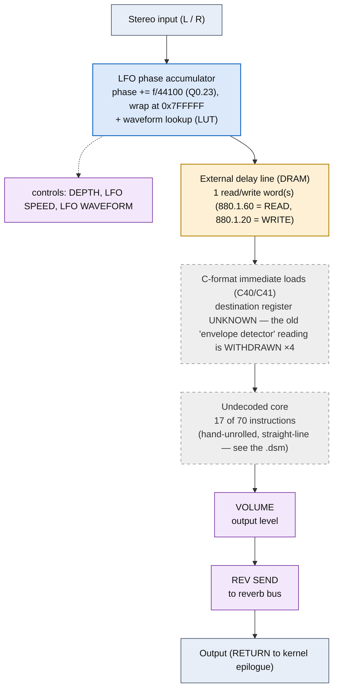

<!-- SYNCED from kn5000-roms-disasm dsp/flowcharts/prog01_chorus.md by tools/sync_flowcharts.py -- DO NOT EDIT; run `make flowcharts`. -->

# CHORUS &mdash; signal-flow flowchart

<!-- GENERATED by dsp/tools/gen_dsp_flowcharts.py -- DO NOT EDIT. -->
<!-- Structure comes from the ROM words + the notes; edit those and re-run. -->

Image rep **algo 1** &middot; slots 1 &middot; **unit 0** (I-RAM load 84) &middot; family **modulation** &middot; confidence **high**.

> quadrature 2-voice chorus (LFO-swept delay, wet 0.25/0.15)

**70 words**, 19 class-A coefficient multiplies (2 named), 17 instructions still opaque. Landmarks detected: 1 LFO phase word(s), 4 C-format immediate load(s), 1 DRAM read/write word(s), 2 waveshaper LUT selector(s).

**UI parameters** (MEASURED, `notes/kn5000-dsp-paramlist.md`): DEPTH, LFO SPEED, LFO WAVEFORM, VOLUME, REV SEND.

Per-instruction detail: [`../disasm/prog01_chorus.dsm`](https://github.com/ArqueologiaDigital/kn5000-roms-disasm/blob/main/dsp/disasm/prog01_chorus.dsm). Confidence legend and method: [`README.md`]({{ site.baseurl }}/effects-dsp/flowcharts/). Narrative: the MAME development blog, KN5000 effects-DSP series (Parts 78-84). Reference: the project docs site, `/effects-dsp/`.
