# SSF Presentation System

The KN5000 contains an XML-based **SSF (Sound Slide Film)** presentation system that drives the built-in Feature Demo mode. It displays a synchronized slideshow of FTBMP bitmap images (Technics globe, speaker system, floppy disks, surround sound diagram, KN5000 branding) alongside demo song playback. The system is orchestrated by an XML-like SSF script (`hkst_55.ssf`) stored in the Table Data ROM, which references named NAKA widget objects for each slide.

This page consolidates all research findings about the SSF system into a single reference. For the broader Feature Demo investigation (timer bugs, MAME emulation status, Lua trace logs), see the [Feature Demo]({{ site.baseurl }}/feature-demo/) page.

---

## Table of Contents

- [UI State Machine](#ui-state-machine)
- [Event Dispatch Chain](#event-dispatch-chain)
- [SSF Script System](#ssf-script-system)
- [FTBMP Image Format](#ftbmp-image-format)
- [Rendering Pipeline](#rendering-pipeline)
- [Demo Timer and Song Playback](#demo-timer-and-song-playback)
- [Key DRAM State Variables](#key-dram-state-variables)
- [Key Routines](#key-routines)
- [Known Bug: MAME SSF Never Activates](#known-bug-mame-ssf-never-activates)
- [Investigation Progress (March 2026)](#investigation-progress-march-2026)
  - [Major Discovery: SSF Triggered by Tone Gen Events](#major-discovery-ssf-triggered-by-tone-gen-events-trace-session-5)
  - [Callback Chain Confirmation (ROM Analysis)](#callback-chain-confirmation-rom-analysis)
- [Refocusing on Hardware Emulation](#refocusing-on-hardware-emulation-march-2026)
- [Voice Lifecycle and Sequencer Parts (Trace Session 8)](#voice-lifecycle-and-sequencer-parts-trace-session-8)
  - [Accompaniment Engine Analysis (Trace Session 9)](#accompaniment-engine-analysis-trace-session-9)
- [Interpretation](#interpretation)

---

## UI State Machine

The Feature Demo operates within the KN5000's global UI state machine. The current UI state is stored as a byte at DRAM address `0x8D38` and is read by the getter function at `0xF0618F`.

### States

| State (DRAM `0x8D38`) | Name | Description |
|------------------------|------|-------------|
| `0x01` | Normal | Home screen, normal keyboard operation |
| `0xE0` | Demo Menu | Top-level DEMONSTRATION menu |
| `0xE1` | Demonstration | Demonstration/performances playing (song cycling active) |
| `0xE2` | Style Select | Style selection sub-menu within demo |
| `0xE3` | Rhythm Select | Rhythm selection sub-menu within demo |
| `0xE4` | Feature Presentation | Feature Presentation sub-menu (SSF trigger point) |

### Activation Button Sequence

From the home screen, the correct sequence to reach the Feature Presentation:

1. Press **DEMO** button -- `0x8D38` transitions `0x01` to `0xE0` (DEMONSTRATION menu appears)
2. Press **LEFT 4** (4th soft button from top, mapped to `CPL_SEG9`) -- `0x8D38` transitions `0xE0` to `0xE4` (FEATURE PRESENTATION sub-menu appears)
3. Press **LEFT 2** (2nd soft button from top, mapped to `CPL_SEG10`) -- `0x8D38` transitions `0xE4` to `0xE1` (demo begins playing)

State transitions are routed through `UI_PostModeChangeEvent`, which sends event `0x1C00015` to `SeqState_TransitionMode`.

### MAME Button Mapping Reference

| Button | MAME Input Port |
|--------|----------------|
| LEFT 1-2 | `CPL_SEG10` |
| LEFT 3-5 | `CPL_SEG9` |
| RIGHT 1-3 | `CPL_SEG8` |
| RIGHT 4-5 | `CPL_SEG7` |

Buttons are numbered top-to-bottom along the LCD edges.

---

## Event Dispatch Chain

The SSF presentation activation involves a 7-stage event dispatch chain, from physical button press to bitmap rendering. Understanding this chain is critical to diagnosing the MAME activation bug.

### Stage 1: Button Press to DRAM

A physical button press on the control panel is detected by the **Control Panel MCU** (a separate microcontroller). The MCU writes key scan data into shared DRAM, where the main CPU can read it. See [Control Panel Protocol]({{ site.baseurl }}/control-panel-protocol/) for the serial protocol details.

### Stage 2: UIState_KeyScan_Dispatch (0xF98697)

This function is the SSF event gatekeeper. It:

1. Checks bit 7 of DRAM `0x0406` (a boot-complete flag set by `Boot_DisplayScreen`; cleared only during flash updates)
2. Reads the current UI state byte `R` from DRAM `0x8D38`
3. Loads a ROM pointer `P = SSF_PresentationGateTable[0xE01F80 + R * 4]`
4. Walks the 16-bit state-value array at `P`, comparing each entry against the packed panel state `(DRAM[0xC080] << 8) | DRAM[0xC07D]`
5. If a match is found (or the array starts with the unconditional marker `0xFFFE`), packs key data into XDE and dispatches **event `0x1C00038`**

The gate table entry for state `0xE4` (Feature Presentation) contains the **unconditional marker** `0xFFFE`, meaning any key press in this state broadcasts `0x1C00038`.

### Stage 3: EventDispatch_Direct (0xFA9945)

The broadcast event router. It maintains a registration table in a ring buffer at DRAM `0x02BC34` (head/tail pointers at `0x02EC34`/`0x02EC36`). For each registered entry matching event code `0x1C00038`, it forwards the event to the registered handler widget.

### Stage 4: GroupBoxProc Receives 0x1C00038

`GroupBoxProc` is a UI container widget handler. Its event dispatch table includes:

```
cp xde, 0x1C00038
jrl z, GroupBoxProc_StartSSFPresentation
```

When `GroupBoxProc` receives `0x1C00038`, it routes directly to the SSF startup routine.

### Stage 5: GroupBoxProc_StartSSFPresentation (0xF9A273)

This is the critical function that constructs the SSF workspace:

1. Allocates a 12-byte workspace from the firmware heap
2. Builds the workspace bytes individually from stack-resident parameters: `workspace[0]=0x0A`, `workspace[1]=0xB8`, `workspace[2..3]=0x00` -- producing the **type-tag `0x0000B80A`**
3. Sends **event `0x1C0001C`** via direct `SendEvent` (`0xFA9660`)

The type-tag `0x0000B80A` is the magic value that identifies this workspace as an SSF presentation request.

### Stage 6: AcPresentationControlProc (0xF8450B)

The main presentation controller. When it receives event `0x1C0001C`, sub-handler `AcPresentCtrl_CheckSSFStart` (0xF84625) checks:

```
*(workspace_pointer) == 0xB80A ?
```

If the tag matches, it sends **event `0x1C00006`** to begin SSF parsing. If the tag does not match (as happens with the automated demo path's `0x82xx` tags), the SSF never starts.

### Stage 7: SSF Parser and Bitmap Rendering

Event `0x1C00006` triggers the SSF XML parser chain:

```
ApPreControl receives 0x1C00006
  -> FDemo_ProcessDisplayStateQuery
    -> FDemoText_ProcessTextMarkup
      -> DrawBitmapFile (bitmap render to VRAM)
```

The parser reads `hkst_55.ssf` from ROM, processes `<SHOW OBJ="...">` actions, and renders FTBMP bitmaps to the display.

### Full System Flowchart

The following flowchart shows the complete SSF activation path from button press to bitmap rendering, including all decision points and the two competing event paths (correct path via GroupBoxProc vs. automated path via DemoMenu). Red nodes indicate where the chain breaks in MAME.

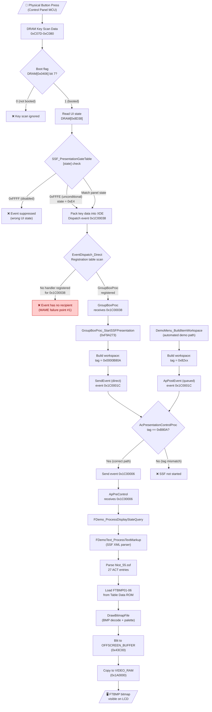

### UI State Machine Flowchart

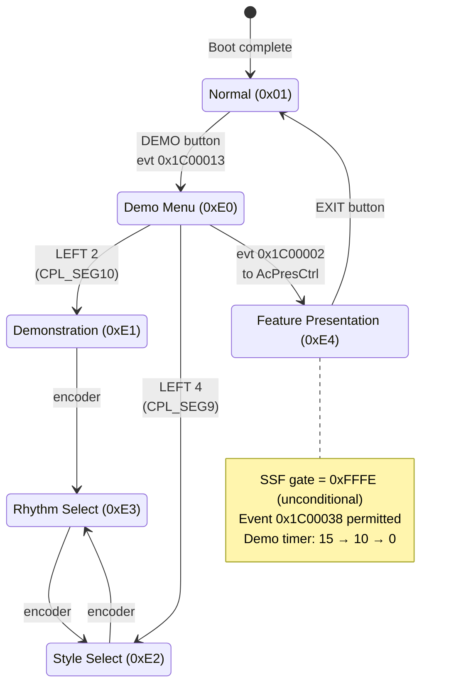

### Demo Timer and Song Playback Flowchart

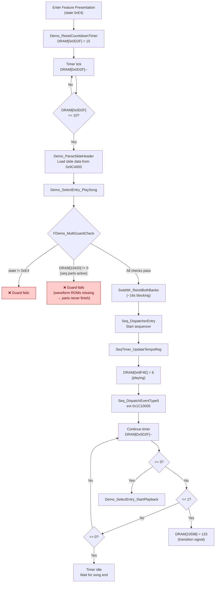

### Rendering Pipeline Flowchart

```mermaid
flowchart LR
    BMP["FTBMP in Table Data ROM<br/>(BMP file, 8bpp indexed)"] --> HDR["Validate BMP header<br/>biSize=0x28, biBitCount≤8"]
    HDR --> PAL["Load 256-color palette<br/>→ OFFSCREEN_BUFFER_4<br/>(0x69400)"]
    PAL --> DECODE["Gfx_ProcessSplashData<br/>1bpp/4bpp/8bpp decode"]
    DECODE --> REMAP["Gfx_DecodeImageToBuffer<br/>Palette remap"]
    REMAP --> BUF1["Write to OFFSCREEN_BUFFER_1<br/>(0x43C00, 76800 bytes)"]
    BUF1 --> VRAM["Mem_Copy to VIDEO_RAM<br/>(0x1A0000)"]
    VRAM --> PALREG["ChangePalette_Impl<br/>Write VGA port 0x3C9"]
    PALREG --> LCD[/"320×240 8bpp LCD"/]
```

---

## SSF Script System

### SSF File Location

The SSF script is embedded in the Table Data ROM:

| File | Metadata Address | XML Data Address | Purpose |
|------|-----------------|------------------|---------|
| `hkst_55.ssf` | 0x87FFF0 | 0x88000E | Feature Demo presentation script |
| `hkt_87.ssf` | Near boot vectors | Unknown | Possibly a second presentation |

**Source file:** `roms-disasm/table_data/includes/hkst_55.ssf`

### Metadata Header (0x87FFF0)

```c
struct FeatureDemo_FileMetadata {
    char   filename[12];    // +0x00: "hkst_55.ssf"
    uint32 reserved;        // +0x0C: 0
    uint32 padding_ptr;     // +0x10: pointer to 2-byte padding (HKstSSF_Padding)
    uint32 xml_ptr;         // +0x14: pointer to XML data (0x88000E)
    uint32 entries_ptr;     // +0x18: pointer to file entries (0x8CE01C)
};
```

### XML Format

The script uses an XML-like markup language with a defined tag vocabulary:

```xml
<ACTION>
  <ACT NO=1><SHOW OBJ="ftdemo01"></ACT>
  <ACT NO=2><SHOW OBJ="ftdemo04"></ACT>
  <ACT NO=3><SHOW OBJ="ftdemo05"></ACT>
  ...
  <ACT NO=27><SHOW OBJ="ftdemo48"></ACT>
</ACTION>
```

The script defines **27 sequential actions**, each referencing a named NAKA widget object. Objects include `ftdemo01` through `ftdemo48` (bitmap resource references) plus interactive displays like `Accordion`, `Drawbar`, and `Sdmixer`.

### XML Tag Vocabulary

The firmware contains a complete XML tag name table in the Program ROM:

#### Structure Tags

| Tag | Close Tag | Purpose |
|-----|-----------|---------|
| `PRESENTATION` | `/PRESENTATION` | Top-level presentation wrapper |
| `ACTION` | `/ACTION` | Action sequence container |
| `ACT` | `/ACT` | Individual action step (with `NO=` attribute) |

#### Content Tags

| Tag | Close Tag | Purpose |
|-----|-----------|---------|
| `SHOW` | -- | Show/display a named UI object |
| `IMG` | -- | Display an image |
| `SONG` | -- | Play a song or MIDI sequence |
| `FONT` | `/FONT` | Font selection for text rendering |
| `CENTER` | `/CENTER` | Text centering |
| `BR` | -- | Line break |

#### Attribute and Command Tags

| Tag | Purpose |
|-----|---------|
| `SRC` | Source reference (file/resource) |
| `NAME` | Name identifier |
| `EXEC` | Execute a command or routine |

The `EXEC` tag is particularly notable -- it suggests the presentation format was designed for general-purpose use beyond simple slideshow display, supporting code execution as part of scripted presentations.

### Timer Events for Slide Transitions

Slide transitions within the SSF presentation are controlled by timer events:

| Event Code | Purpose |
|------------|---------|
| `0x1C10005` | Slide transition timer tick |
| `0x1C10006` | Slide transition complete |

### Widget Data

The NAKA widget system manages SSF UI elements. Widget data for the Feature Demo lives in `naka_perf_style.c`, which contains FTBMP filename strings and widget descriptor structures. The `ftdemo01`-`ftdemo48` names are bitmap resource references -- simple filename strings (e.g., `aligned_string "ftdemo43"`) that identify image resources loaded during the demo.

Interactive objects (`Accordion`, `Drawbar`, `Sdmixer`) are container objects with child sub-objects, handler procedures, and rendering routines. See [UI Widget Types]({{ site.baseurl }}/ui-widget-types/) for the widget descriptor format.

### Object Dispatch

When `AcPresentationControlProc` processes a `<SHOW OBJ="...">` action:

1. The XML parser extracts the OBJ name string
2. The name is matched against the `NAKA_UIObjectTable` (~141 entries)
3. For bitmap resources (`ftdemo01`-`ftdemo48`): extracts the filename pointer from the structure, looks up the file entry index, loads BMP data from ROM, renders to VRAM
4. For container objects (`Accordion`, `Drawbar`, `Sdmixer`): activates the interactive UI handler

The dispatch uses a **jump table at `0xE9F9B2`** indexed by event type. Event codes `0x1C00002` through `0x1C0000C` branch to specific handlers.

---

## FTBMP Image Format

### Format Specification

FTBMP images are standard **Windows BMP** files:

- **Color depth:** 8-bit indexed (256 colors)
- **Compression:** None (uncompressed)
- **Resolutions:** 320x240 (full screen) or 320x120-130 (partial, for overlay compositing)
- **Palette:** 256-color BGRX format (1024 bytes), output through a 4-bit RAMDAC

### Image Inventory

Six FTBMP images are stored contiguously in the Table Data ROM:

| Asset | ROM Address | Size (bytes) | Resolution | Content |
|-------|-------------|-------------|------------|---------|
| `FTBMP01.BMP` | 0x880418 | 77,878 | 320x240 | Technics logo with world globe |
| `FTBMP02.BMP` | 0x89344E | 42,678 | 320x~130 | Subwoofer speaker system |
| `FTBMP03.BMP` | 0x89DB04 | 39,478 | 320x~120 | Floppy discs |
| `FTBMP04.BMP` | 0x8A753A | 39,478 | 320x~120 | Inserting discs |
| `FTBMP05.BMP` | 0x8B0F70 | 41,078 | 320x~125 | Surround sound arrows |
| `FTBMP06.BMP` | 0x8BAFE6 | 77,878 | 320x240 | KN5000 name with rainbow comet |

**Total bitmap storage:** 318,468 bytes (~311 KB)

### File Entry Index (0x8CE01C)

A FAT-like file directory indexes the FTBMP images. Six entries of 24 bytes each are stored contiguously:

```c
struct FeatureDemo_FileEntry {
    char   filename[12];    // +0x00: null-terminated (e.g., "FTBMP01.BMP")
    uint32 reserved;        // +0x0C: always 0
    uint32 data_ptr;        // +0x10: pointer to BMP data in ROM
    uint32 file_size;       // +0x14: size in bytes
};  // Total: 24 bytes per entry
```

The metadata header at 0x87FFF0 links the SSF script to this file entry index via its `entries_ptr` field.

---

## Rendering Pipeline

### Overview

The bitmap rendering pipeline is entirely ROM-resident -- no disk I/O occurs. The path from SSF action to pixels on screen:

```
SSF <SHOW OBJ="ftdemo01">
  -> NAKA_UIObjectTable lookup -> FTDEMO_SCREEN structure
    -> filename pointer -> "FTBMP01"
      -> file entry index lookup at 0x8CE01C
        -> BMP data pointer (0x880418)
          -> DrawBitmapFile -> VRAM
```

### DrawBitmapFile

The core rendering function is `DrawBitmapFile` (in `drawing_primitives.s`, around line 3346). It performs:

1. **BMP header validation** -- verifies the Windows BMP header magic and fields
2. **Palette loading** -- reads the 256-color BGRX palette and loads it to `OFFSCREEN_BUFFER_4` (0x69400)
3. **Pixel decode** -- via `Gfx_ProcessSplashData`, supporting 1bpp, 4bpp, and 8bpp decode modes
4. **Color remap** -- via `Gfx_DecodeImageToBuffer`, remaps palette indices through the 4-bit RAMDAC
5. **VRAM blit** -- copies the decoded pixel data to the display framebuffer
6. **Palette commit** -- writes the final palette to the hardware palette registers

### Display Buffers

The display subsystem uses multiple offscreen buffers for compositing:

| Buffer | DRAM Address | Purpose |
|--------|-------------|---------|
| `OFFSCREEN_BUFFER_1` | 0x43C00 | Primary offscreen compositing |
| `OFFSCREEN_BUFFER_2` | 0x56800 | Secondary offscreen compositing |
| `OFFSCREEN_BUFFER_3` | 0x5FE00 | Tertiary offscreen compositing |
| `OFFSCREEN_BUFFER_4` | 0x69400 | Palette staging / scratch buffer |
| `VIDEO_RAM` | 0x1A0000 | Hardware framebuffer (320x240 8bpp) |

VRAM occupies 256KB at 0x1A0000-0x1DFFFF. See [Display Subsystem]({{ site.baseurl }}/display-subsystem/) for the full display architecture.

### Related Rendering Functions

| Function | Purpose |
|----------|---------|
| `VwUserBitmapByNameProc` | High-level bitmap-by-name renderer |
| `Gfx_ProcessSplashData` | Multi-depth pixel decoder (1/4/8 bpp) |
| `Gfx_DecodeImageToBuffer` | Color remapping through RAMDAC |
| `AcPresentationBoxProc` (0xF842B4) | Visual frame rendering for presentation slides |

`AcPresentationBoxProc` handles the visual frame, responding to message types `0x1E0003C`, `0x1E0003A`, `0x1C0001B` and calling display routines at `0xFA6266`, `0xFA4409`.

---

## Demo Timer and Song Playback

### Timer State Machine

The Feature Demo uses a timer-driven state machine. The timer variable is at DRAM address `0x0D2F`.

**Timer countdown sequence:**

| Timer Value | Action |
|-------------|--------|
| 15 | Initial countdown begins |
| 10 | `Demo_ParseSlideHeader` + `Demo_SelectEntry_PlaySong` -- loads next slide and starts song playback |
| 3 | `Demo_SelectEntry_StartPlayback` -- begins accompaniment |
| 1 | Display state update |
| 0 | Next demo item (but gets stuck here without waveform ROMs) |

### Song Playback

When the timer reaches 10, song playback begins:

1. `Demo_SelectEntry_PlaySong` is called
2. Song lookup via Table Data ROM: `0x9C4000 + (song_index * 4)` yields the song data pointer
3. `SwbtWr_ReinitBothBanks` is called, which runs the SwbtWr dispatch loop inline
4. The dispatch loop processes ~450 buffered tone generator events
5. Each callback takes ~35ms, causing a **~16 second blocking period** where the main loop is paused
6. After processing completes, `PlaySong` returns and sets `DRAM[0x8F4E]` from `0x04` to `0x06`

### Song List Processing

`Demo_SelectEntry_ProcessSongList` (0xF86D86) manages song cycling:

1. Checks if the song list at DRAM address `0x28B4` (10420) is empty
2. Checks bit 3 of DRAM `0x28AD` (10413) for auto-play vs. manual mode
3. In auto-play mode: compares current song index (`0x28A4`) with target (`0x1157`)
4. Calls `Demo_WaitForDisplayBit` -- busy-wait checking bit 2 of DRAM `0x0420` with `0xFFFFFF` timeout
5. Calls `Banner_Loop_Check` -- sends note-off commands (status 0xD3) to all 16 channels
6. Increments song index and loops

---

## Key DRAM State Variables

| Address (hex) | Address (dec) | Description |
|--------------|---------------|-------------|
| `0x0406` | 1030 | Boot-complete flag (bit 7 set by `Boot_DisplayScreen`, cleared during flash updates) |
| `0x0420` | 1056 | Display status flags (bit 2 = display busy) |
| `0x0D2F` | 3375 | Demo timer countdown value (15 -> 10 -> 0) |
| `0x0D33` | 3379 | Debounce counter |
| `0x1157` | 4439 | Target song index |
| `0x1158` | 4440 | Current song index |
| `0x28A4` | 10404 | Active demo entry index |
| `0x28AD` | 10413 | Demo control flags (bit 3 = auto-play) |
| `0x28B4` | 10420 | Song list pointer / sequencer part active flags |
| `0x8D34` | 36148 | UI state byte |
| `0x8D38` | 36152 | UI sub-state byte (0x01=normal, 0xE0=demo menu, 0xE4=feature presentation) |
| `0x8D3A` | 36154 | Part select index (used by `DemoMenu_BuildItemWorkspace`) |
| `0x8F4E` | 36686 | Playback state flag (0x04=playing, 0x06=done) |
| `0xBD3C` | 48444 | Event dispatch circular buffer (4-byte entries) |
| `0xC07D` | 49277 | Panel key param byte |
| `0xC080` | 49280 | Panel chain index byte |
| `0x0249CC` | 149964 | SSF parser state (internal) |
| `0x0249D4` | 149972 | SSF parser position (internal) |
| `0x0251D8` | 152024 | Demo display state machine (`0x0000` = idle, never advances in MAME) |
| `0x02BC34` | 179252 | Event registration table (ring buffer, head/tail at 0x02EC34/0x02EC36) |
| `0x10420` | 66592 | Sequencer part active flags (`0xFFFF` = all 16 parts active) |

---

## Key Routines

| Function | ROM Address | Source File | Purpose |
|----------|-------------|-------------|---------|
| `UIState_KeyScan_Dispatch` | 0xF98697 | `presentation_sound_nav.s` | SSF gate check: reads UI state, checks gate table, sends event 0x1C00038 |
| `EventDispatch_Direct` | 0xFA9945 | (event system) | Broadcast event router with registration table |
| `GroupBoxProc_StartSSFPresentation` | 0xF9A273 | `presentation_sound_nav.s:33` | Builds workspace with tag 0x0000B80A, sends event 0x1C0001C |
| `AcPresentationControlProc` | 0xF8450B | `drawbar_panel_ui.s:15535` | Main presentation controller; dispatches via jump table at 0xE9F9B2 |
| `AcPresentCtrl_CheckSSFStart` | 0xF84625 | `drawbar_panel_ui.s` | Checks workspace tag == 0xB80A, gates SSF start |
| `AcPresentationBoxProc` | 0xF842B4 | `drawbar_panel_ui.s` | Presentation visual frame rendering |
| `AcFdemoScreenProc` | 0xF84149 | `drawbar_panel_ui.s` | Feature Demo screen handler |
| `DemoModeFunc` | 0xF222CC | `demo_routines.s` | Main demo mode dispatcher (event 0x1C00013) |
| `DemoMode_Initialize` | 0xF869E3 | `demo_routines.s` | First-time demo setup (voice save, audio init) |
| `DemoMode_Main_Operation` | 0xF8696F | `demo_routines.s` | Main demo playback loop |
| `DemoMenu_BuildItemWorkspace` | 0xF83CEA | `drawbar_panel_ui.s:14643` | Builds 0x82xx workspace (automated path -- wrong tag for SSF) |
| `Demo_SelectEntry_TimerTick` | 0xF86D45 | `demo_routines.s` | Timer-driven state machine entry point |
| `Demo_SelectEntry_PlaySong` | -- | `demo_routines.s` | Song loading and SwbtWr initialization |
| `Demo_SelectEntry_ProcessSongList` | 0xF86D86 | `demo_routines.s` | Song cycling and index management |
| `Demo_WaitForDisplayBit` | 0xF86F2C | `demo_routines.s` | Timeout-protected busy-wait for display ready |
| `FDemo_ProcessDisplayStateQuery` | -- | (presentation chain) | Processes display state after SSF event 0x1C00006 |
| `FDemoText_ProcessTextMarkup` | -- | (presentation chain) | Processes XML text markup for rendering |
| `DrawBitmapFile` | -- | `drawing_primitives.s:3346` | BMP header validation, palette load, pixel decode, VRAM blit |
| `Gfx_ProcessSplashData` | -- | `drawing_primitives.s` | Multi-depth pixel decoder (1/4/8 bpp) |
| `Gfx_DecodeImageToBuffer` | -- | `drawing_primitives.s` | Color remap via RAMDAC lookup |
| `IvDemofeature1Proc` | -- | (demo handlers) | Feature Demo event handler 1 |
| `IvDemofeature2Proc` | -- | (demo handlers) | Feature Demo event handler 2 |
| `PostEvent` (`FA9752`) | 0xFA9752 | (event system) | Inserts events into circular queue at DRAM 0x02BC34 |
| `SendEvent` | 0xFA9660 | (event system) | Direct (synchronous) event dispatch |
| `PostEventWithParam` | 0xFA9D58 | (event system) | Queued (deferred) event dispatch with parameter |
| `Boot_DisplayScreen` | -- | (boot sequence) | Sets DRAM[0x0406] bit 7 (boot-complete flag) |
| `SeqState_TransitionMode` | -- | (sequencer) | Processes mode change event 0x1C00015 |

---

## Known Bug: MAME SSF Never Activates

**Status (March 2026):** The SSF visual presentation (FTBMP bitmap rendering) does not trigger in MAME. The demo timer and song cycling work, but no slides are ever displayed. The tone generator hold timer bug has been fixed (voices no longer get stuck active when waveform ROMs are missing), which resolved 12 of 16 sequencer parts clearing naturally. A workaround timer handles the remaining 4 stuck accompaniment parts. The primary remaining blocker is the event routing issue -- see [Investigation Progress (March 2026)](#investigation-progress-march-2026).

### Symptom Chain

Each of these conditions has been confirmed via MAME Lua trace scripts:

1. **Event `0x1C00038` never reaches GroupBoxProc** -- the event that should trigger SSF startup is never dispatched post-boot
2. **`GroupBoxProc_StartSSFPresentation` never fires** -- the function that builds the correct `0xB80A` workspace is never called
3. **The `0xB80A` workspace tag is never constructed** -- no SSF workspace exists in DRAM
4. **`AcPresentationControlProc` always fails the tag check** -- the automated path produces `0x82xx` tags, not `0xB80A`
5. **`demo_state` at DRAM `0x0251D8` stays `0x0000`** -- the visual state machine never advances

### Two Distinct Activation Paths

The Feature Demo has two completely different code paths for activating the SSF presentation. Their workspace tag behavior is fundamentally incompatible:

#### Path 1: Manual Button Press (WORKS on real hardware)

```
Physical button press in state 0xE4
  -> UIState_KeyScan_Dispatch (0xF98697)
    -> event 0x1C00038
      -> GroupBoxProc
        -> GroupBoxProc_StartSSFPresentation (0xF9A273)
          -> workspace tag = 0x0000B80A  [CORRECT]
            -> event 0x1C0001C (direct SendEvent)
              -> AcPresentCtrl_CheckSSFStart: tag == 0xB80A? YES
                -> event 0x1C00006 -> SSF parser starts
                  -> FTBMP bitmaps rendered to VRAM
```

#### Path 2: Automated Demo Timer/Sequencer (FAILS)

```
Demo timer/sequencer
  -> DemoMenu_BuildItemWorkspace (0xF83CEA)
    -> reads table at 0xE9F88C: values in 0x82xx-0x82CC range
    -> workspace tag = 0x82xx + (part_select * 1024)  [WRONG]
      -> event 0x1C0001C (queued PostEventWithParam)
        -> AcPresentCtrl_CheckSSFStart: tag == 0xB80A? NO
          -> event 0x1C00006 NEVER SENT
            -> SSF parser never starts
              -> FTBMP bitmaps never render
```

### Why the Automated Path Cannot Produce 0xB80A

`DemoMenu_BuildItemWorkspace` computes the workspace tag as:

```
tag = table[0xE9F88C + iz*2] + (part_select * 1024)
```

The table at `0xE9F88C` holds 16-bit values in the `0x82xx`-`0x82CC` range. The part select index `R` is read from DRAM `0x8D3A`. The difference `0xB80A - 0x82xx` is never divisible by 1024 for any byte value of `R`, so this formula **cannot** produce `0x0000B80A`. The workspace tag mismatch is architectural.

### Root Cause Candidates

Two independent issues contribute to the failure:

1. **Widget hierarchy not registered for state 0xE4:** `GroupBoxProc` may not be in the active widget chain when the UI is in state `0xE4`. Without user input in MAME's automated test run, the event buffer at `0xBD3C` drains after boot and `UIState_KeyScan_Dispatch` is never invoked again post-boot. The logic would work correctly with actual button input -- table entry[1] for `0x8D38=0x01` contains a valid match at index [79] for chain `0x70`, param `0x02`.

2. **Sequencer parts never complete (PARTIALLY FIXED):** `DRAM[0x10420] = 0xFFFF` (all 16 sequencer parts marked active) blocks `FDemo_MultiGuardCheck`. The tone generator hold timer bug has been fixed -- voices no longer get stuck active when waveform ROMs are missing, allowing 12 of 16 parts to clear naturally. However, 4 accompaniment parts (bits 1, 3, 6, 10 = `0x044A`) remain stuck because they never enter playing state without waveform data. A 1-second workaround timer detects this deadlock condition and force-clears the remaining parts.

### Previously Investigated and Ruled Out

| Hypothesis | Ruling |
|------------|--------|
| Audio initialization delay | `Audio_WaitForReady` has 61,440-iteration timeout; exits gracefully |
| VRAM display mode wrong | VRAM writes do occur; not the primary blocker |
| XML parser state corrupt | Parser never starts because `0x1C00006` is never sent |
| `DemoMode_Main_Operation` loop hang | Expected behavior (`jp Seq_StartMainControl`); not a hang |

---

## SSF Presentation Gate Table

The gate table at ROM address `0xE01F80` is a 256-entry array of pointers to state-value arrays. It controls which UI states allow SSF event `0x1C00038` to be dispatched.

### Known Entries

| Entry | Address | Content | Used by State |
|-------|---------|---------|---------------|
| `SSF_GateStates_Mode00` | 0xE014CE | `{0xFFFF}` -- disabled | 0x00 (boot/init) |
| `SSF_GateStates_Mode01` | 0xE014D0 | ~215 entries (chains 0x00-0x0C, 0x91) | 0x01 (normal) |
| `SSF_GateStates_Mode03` | 0xE01580 | ~215 entries (chains 0x00-0x0C, 0x43, 0x48, 0x70, 0x80, 0x91, 0x98) | 0x03 |
| `SSF_GateStates_Mode04` | 0xE0174A | 1 entry (chain 0x91, param 0x00) | 0x04 |
| `SSF_GateStates_Mode05` | 0xE0174E | 14 entries (chain 0x92, params 0x00-0x0D) | 0x05 |
| State 0xE4 entry | -- | `{0xFFFE}` -- **unconditional** (all keys pass) | 0xE4 (Feature Presentation) |

The unconditional `0xFFFE` marker for state `0xE4` confirms that any key press in the Feature Presentation sub-menu should trigger SSF -- the gate is wide open. The failure in MAME is not due to gating, but due to no key events being generated.

---

## Investigation Progress (March 2026)

### Tone Generator Hold Timer Fix

Voices were getting stuck in the "active" state when waveform ROMs are missing because `hold_counter` and `release_counter` were never decremented -- the `sound_stream_update` loop skipped them via `continue` when `wave_length == 0`. The fix ensures the hold timer runs regardless of `wave_length`, so voices properly time out even without waveform data.

**Results:**

- 12 of 16 sequencer parts now clear naturally after the hold timer expires
- 4 accompaniment parts (bits 1, 3, 6, 10 = `0x044A`) remain stuck because they never enter playing state without waveform data -- the tone generator never receives a KEY ON for these parts, so there is no hold timer to expire
- A 1-second workaround timer was added that detects the deadlock condition (UI state `0xE4`, demo timer at 0, active parts unchanged across 3+ checks) and force-clears `DRAM[0x10420]`

### Event Routing Deep Analysis

The full dispatch chain for event `0x1C00038` was traced through the firmware:

1. **`UIState_KeyScan_Dispatch`** dispatches event `0x1C00038` -- this works correctly when invoked
2. **`EventDispatch_Direct`** posts the event to the ring buffer at `DRAM[0x02BC34]` -- this works correctly
3. **`GetEvent`** dequeues from the ring buffer -- **for broadcast events (target = `0xFFFFFFFF`), it replaces the target with `GetCurrentTarget()`, which reads `DRAM[0x02F83C]`**
4. **`EventHandler_ObjectDispatch`** looks up the resolved target in the object table and calls the proc handler chain
5. If `CurrentTarget`'s proc chain includes `ScreenProc`, the event flows through `Screen_ForwardToGroupBox` to `GroupBoxProc`, and SSF starts
6. **If `CurrentTarget` does NOT include this chain, event `0x1C00038` goes to the wrong widget handler and SSF never starts**

**Key discovery:** `CurrentTarget` at `DRAM[0x02F83C]` is set by `SetCurrentTarget` during screen initialization (event `0x1C00001`). The Feature Presentation screen (`AcFdemoScreenProc`, type `0x69`) must receive event `0x1C00001` to become the `CurrentTarget`.

**Root cause hypothesis:** `SeqState_TransitionMode` only writes the state byte to `DRAM[0x8D38]` -- it does NOT send event `0x1C00001` to the screen widget. The NAKA widget framework's screen management cycle must independently detect the state change and activate the screen. This cycle may be starved because `SwbtWr_ReinitBothBanks` blocks for ~16 seconds during tone generator initialization.

### Broadcast Event Resolution Flowchart

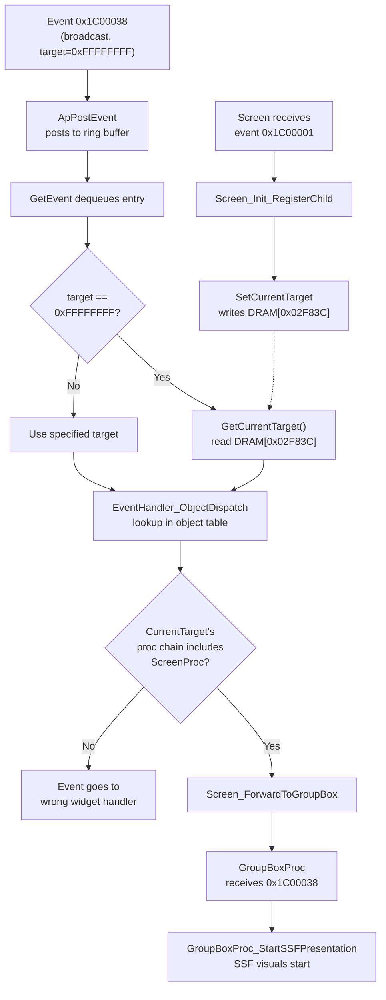

### DSP Status Polling Bug

The SubCPU's DSP ready signal (Port H bit 0) was not connected in MAME, causing every DSP operation to spin through 8,000 timeout iterations. This dramatically inflated the SwbtWr blocking time. See [Tone Generator Initialization — DSP Status Polling Bug](/swbwr-tone-init/#dsp-status-polling-bug-march-2026-discovery) for the full analysis.

### Lua Diagnostic Trace Results

Two diagnostic sessions confirmed:

**Session 1 (ssf_diagnostic.lua):**
- Boot state: ui_state=0x01, current_target=0x00010018, all clean
- Demo Menu: current_target changes to 0x00E00000
- Feature Presentation entry: current_target = 0x00E40002
- During state 0xE4, CurrentTarget cycles between three widget IDs:
  - `0x00E40002` — appears during timer countdown phases
  - `0x00E40000` — appears briefly at timer=10 and timer=0
  - `0x00E4000A` — appears during song playback (stabilizes here)
- Demo timer cycles correctly: 15→10→...→0, songs advance
- `seq_parts` briefly flashes 0xFFFF then clears (workaround timer working)
- **`ssf_flag` at 0x0251D8 stays 0x0000 throughout** — SSF parser never starts
- The Technics globe (FTBMP01) renders as the static screen background for state 0xE4, but never transitions to other slides

**Session 2 (ssf_trace2.lua) — Key Scan Data:**
- **DRAM key scan bytes are NOT zero during state 0xE4:**
  - `C07D=0x09, C07E=0x00, C07F=0x02, C080=0xAA` (initial)
  - Stabilizes to `C07D=0x0E, C07E=0x00, C07F=0x40, C080=0xB1`
- This means the control panel MCU IS sending data via serial
- `UIState_KeyScan_Dispatch` should be reading this data and dispatching event 0x1C00038 (gate for state 0xE4 is 0xFFFE unconditional)
- **Event 0x1C00038 is likely being dispatched** — but it's broadcast (target=0xFFFFFFFF), redirected to CurrentTarget by GetEvent
- CurrentTarget stabilizes at `0x00E4000A` — this widget's proc chain does NOT route through GroupBoxProc

### CurrentTarget Widget ID Pattern

The CurrentTarget values follow a pattern: `0x00SS00II` where SS = UI state byte and II = widget index. During state 0xE4:

| CurrentTarget | Interpretation | When Active |
|---------------|---------------|-------------|
| `0x00E40000` | Widget 0 in state 0xE4 | Brief — at timer=10 and timer=0 |
| `0x00E40002` | Widget 2 in state 0xE4 | During timer countdown |
| `0x00E4000A` | Widget 10 in state 0xE4 | During/after song playback (dominant) |

None of these widgets forward event 0x1C00038 through ScreenProc → Screen_ForwardToGroupBox → GroupBoxProc.

### Updated Hypothesis

The investigation now points to a **widget registration issue**: GroupBoxProc may not be in the object table at all during state 0xE4, or event 0x1C00038 may not be registered for it. A third diagnostic script (ssf_trace3.lua) is scanning the event registration table at DRAM 0x02BC34 and the object table at DRAM 0x027ED2 to determine:
- Is event 0x1C00038 registered for any widget?
- Is GroupBoxProc (address 0xF9983F) present in the object table?
- What widgets ARE registered for 0x1C00038?

This will distinguish between:
- **(A)** GroupBoxProc never registered (widget hierarchy init problem — possible hardware emulation issue)
- **(B)** GroupBoxProc registered but 0x1C00038 not associated with it (event binding problem)
- **(C)** Both registered correctly but CurrentTarget routing bypasses them (dispatch architecture issue)

### Definitive Finding: GroupBoxProc Not Registered (Trace Session 3)

A third diagnostic script (`ssf_trace3.lua`) directly scanned the firmware's runtime data structures during state 0xE4 and produced a **definitive answer**:

| Data Structure | Address | Result |
|----------------|---------|--------|
| Event registration table | `DRAM 0x02BC34` (12-byte entries) | **Event 0x1C00038 is NOT registered** for any widget |
| Object table | `DRAM 0x027ED2` (14-byte entries, up to 1119 slots) | **GroupBoxProc (0xF9983F) is NOT present** in the first 50 entries |

**This confirms root cause (A): GroupBoxProc is never loaded into the object table during Feature Presentation mode.**

The NAKA widget hierarchy that includes GroupBoxProc — which is the only path capable of producing the `0xB80A` workspace tag needed to start the SSF parser — is simply never instantiated. The widget doesn't exist in the runtime data structures during state 0xE4.

Additional observations from the trace:
- Ring buffer pointers: `rb_rd=67, rb_wr=67` (empty on entry), then `rb_rd=205, rb_wr=205` (events flowing and consumed, but none are 0x1C00038)
- The event system IS active — events are being posted and consumed — but 0x1C00038 is never among them because no widget is registered to receive it

### Narrowed Investigation

The question is now narrowed to: **Why doesn't the Feature Presentation screen's NAKA widget hierarchy include GroupBoxProc?**

Possible explanations:
1. **Missing screen initialization:** The NAKA widget framework loads screen-specific widget trees when transitioning between UI modes. The Feature Presentation screen (state 0xE4) may require a specific initialization sequence that isn't completing in MAME — possibly due to a hardware emulation issue (missing interrupt, timer, or I/O behavior) that prevents the screen loader from running.

2. **GroupBoxProc loaded at a different time:** On real hardware, GroupBoxProc may only be registered when specific conditions are met (e.g., after the first song completes, or when a specific timer expires). The current scan window may be too early.

3. **GroupBoxProc in a higher object table slot:** The initial scan only checked 50 of 1119 possible slots. A deeper scan (500 entries) plus a full-range proc address search is being run to rule this out.

4. **Widget hierarchy differs between UI states:** GroupBoxProc may be registered during state 0x01 (Normal) but unregistered during state 0xE4 (Feature Presentation) if the screen transition replaces the widget tree. In that case, the Feature Presentation screen's widget data (in `naka_perf_style.c`) may simply not include a GroupBox container widget — which would mean the SSF system was designed to be triggered by a different mechanism on real hardware.

A fourth diagnostic script (`ssf_trace4.lua`) is performing:
- Full 200-entry object table dump looking for GroupBoxProc, ScreenProc, AcFdemoScreenProc, and AcPresentationControlProc
- Complete event registration table dump (first 50 entries with event code annotations)
- 500-entry deep scan for any proc pointer in the 0xF99xxx address range
- CurrentTarget widget details

This will provide a complete picture of what widgets ARE registered during state 0xE4 and whether GroupBoxProc exists anywhere in the system at that point.

### Deep Scan Results (Trace Session 4)

A comprehensive scan of the firmware's runtime data structures revealed a critical finding that overturns previous assumptions:

**Event 0x1C00038 IS registered — but with filter params that don't match the key scan data.**

| Slot | Target | Event | Param | Interpretation |
|------|--------|-------|-------|----------------|
| 10 | `0xFFFFFFFF` | `0x01C00038` | `0x10001AFF` | Expects chain=0x10, param=0x1A |
| 11 | `0xFFFFFFFF` | `0x01C00038` | `0x11001DFF` | Expects chain=0x11, param=0x1D |
| 12 | `0xFFFFFFFF` | `0x01C00038` | `0x120006FF` | Expects chain=0x12, param=0x06 |

`EventDispatch_Direct` filters events by matching the upper 16 bits of XDE (`(DRAM[0xC080] << 8) | DRAM[0xC07D]`) against registered params. The actual key scan data has `C080=0xB1, C07D=0x0E` → match value `0xB10E`. **None of the three registered entries match.**

The registered entries expect chain bytes `0x10`, `0x11`, `0x12` — which appear to be right-panel segment indices (segment 0, 1, 2) with a type flag. The control panel HLE sends button packets with header bytes in ranges `0x00-0x0A` (right panel) or `0xC0-0xCA` (left panel). Chain value `0xB1` doesn't match any valid button packet format (`0xB1` has bits 7:6 = `10`, which is not a valid panel code — only `00` and `11` are mapped).

**Hypothesis: The firmware generates synthetic key events during the demo.** The values `0x10`, `0x11`, `0x12` in the registration params are NOT button scan values — they're internal event codes that the demo sequencer or timer handler writes to DRAM[0xC07D-0xC080] to simulate button-driven navigation. If this synthetic key generation depends on a hardware feature that isn't correctly emulated (e.g., a specific timer, interrupt, or I/O port behavior), the filter params would never match and the SSF chain would never trigger.

**Additional findings from the deep scan:**
- Object table: 200+ active entries (first 200 all populated), but NO proc pointer in the 0xF99xxx range (GroupBoxProc) found across 500 entries
- GroupBoxProc is genuinely absent from the runtime — it's never instantiated
- SSF workspace events `0x1C0001C` are registered (7 entries at slots 14-43), confirming the SSF system IS set up to receive workspace events
- Widget init event `0x1C00001` is registered at slot 1
- Mode change event `0x1C00015` is NOT in the first 50 entries

### Revised Root Cause Theory

The SSF failure chain is now understood at a deeper level:

```
Demo timer → demo system should generate synthetic key event
  → writes chain/param to DRAM[0xC07D-0xC080]
  → UIState_KeyScan_Dispatch reads key data, dispatches 0x1C00038
  → EventDispatch_Direct filters by (C080<<8)|C07D against registered params
  → Filter FAILS because synthetic key generation produces wrong values
  → Event 0x1C00038 never reaches any handler
  → GroupBoxProc_StartSSFPresentation never called
  → SSF parser never starts
  → Stuck on globe
```

The investigation now needs to trace **what firmware code writes to DRAM[0xC07D] and DRAM[0xC080]** during the demo, and what hardware behavior controls the synthetic key event values. A MAME Lua write tap script (`ssf_trace5.lua`) has been deployed to capture:
- The PC (program counter) of every instruction that writes to C07D or C080
- Whether chain values 0x10/0x11/0x12 ever appear in C080
- A summary of all unique writer addresses

This will identify whether the key scan data comes from the control panel serial interface (expected: control panel HLE writes button scan data) or from an internal firmware source (expected: demo system generates synthetic key events). If the demo system never writes the expected chain values, the issue is either that (a) the demo system's synthetic key generation depends on a hardware feature not yet emulated, or (b) the control panel MCU on real hardware sends different data than the HLE.

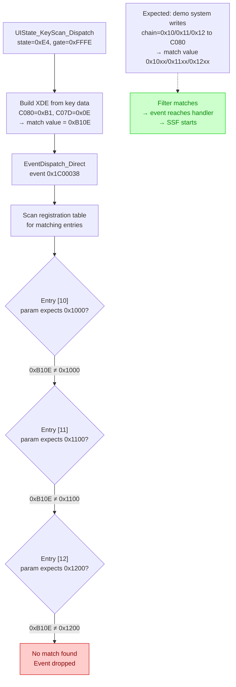

### Major Discovery: SSF Triggered by Tone Gen Events (Trace Session 5)

The write tap investigation revealed that **DRAM[0xC080] (the "chain byte") is written by `SwbtWr_DispatchLoop`** at `dsp_config_sysex.s:902`:

```asm
SwbtWr_DispatchLoop:
    ld l, (xiy)           ; Load event code from buffer
    stda8 49280, l        ; Write to C080 (chain byte)
    ...
    stda16 49277, xwa     ; Write event params to C07D-C07E
    stda8 49279, c        ; Write to C07F
```

This means **the SSF event registration entries (0x10, 0x11, 0x12) are SwbtWr tone generator parameter event codes**, NOT button scan values or control panel data!

**The SSF slide transition mechanism is:**
1. SwbtWr processes tone gen parameter events during song initialization/playback
2. Each event code is written to DRAM[0xC080] before the callback fires
3. Event params are written to DRAM[0xC07D-0xC07F]
4. After the callback, `UIState_KeyScan_Dispatch` is called (from the handler table)
5. For state 0xE4 (gate=0xFFFE unconditional), event 0x1C00038 is dispatched
6. `EventDispatch_Direct` matches `(C080<<8)|C07D` against registered params
7. If the SwbtWr event code matches 0x10, 0x11, or 0x12, the SSF handler fires

**What events 0x10/0x11/0x12 represent:**
These are tone generator parameter indices in the SwbtWr callback table. They likely correspond to specific sound parameters (voice selection, preset change, or DSP configuration) that signal a song transition or section change — the natural trigger for advancing to the next slide.

**Why it fails in MAME:**
The SwbtWr event buffer is populated by `ToneGen_DiffScanAndUpdate`, which scans the 606-byte parameter space for changes. If events 0x10/0x11/0x12 are never generated (perhaps because missing waveform ROMs affect which tone gen parameters change, or because the DSP configuration path doesn't produce these specific event codes), the filter never matches and slides never advance.

**Verification in progress (Trace Session 6):** A diagnostic script is scanning both DRAM[0xC080] (the live chain byte) and the SwbtWr event buffer at DRAM[0xBD3C] for event codes 0x10/0x11/0x12 during the Feature Demo. This will determine:
- Whether these event codes are **ever generated** in the buffer (parameter diff produces them)
- Whether they appear in C080 (SwbtWr_DispatchLoop processes them)
- What the full set of event codes is that the demo actually generates

If the events are never generated, the root cause is in `ToneGen_DiffScanAndUpdate` — the parameter diff between the current and new sound preset never touches the byte offsets that correspond to event codes 0x10/0x11/0x12. This could be because (a) the preset data is identical at those offsets, (b) the baseline parameter state is wrong due to missing waveform ROM data, or (c) the parameter space layout differs from what we expect.

**This completely reframes the problem:** The SSF system is NOT driven by button presses or widget navigation. It is driven by **tone generator parameter changes** during song playback. The slides are synchronized to the music by being triggered when specific sound preset parameters change.

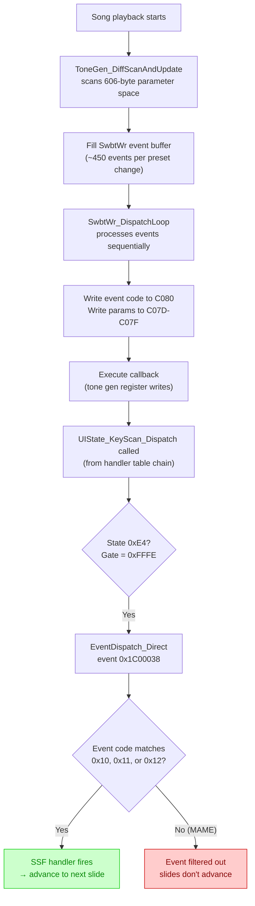

### Confirmed Root Cause Flowchart (Revised After Trace 4)

Note: Trace 3 initially reported event 0x1C00038 as unregistered (timing issue — scan ran before registration completed). Trace 4's deeper scan corrected this: **the event IS registered but the filter params don't match the key scan data.** GroupBoxProc is genuinely absent from the object table (confirmed by 500-entry deep scan).

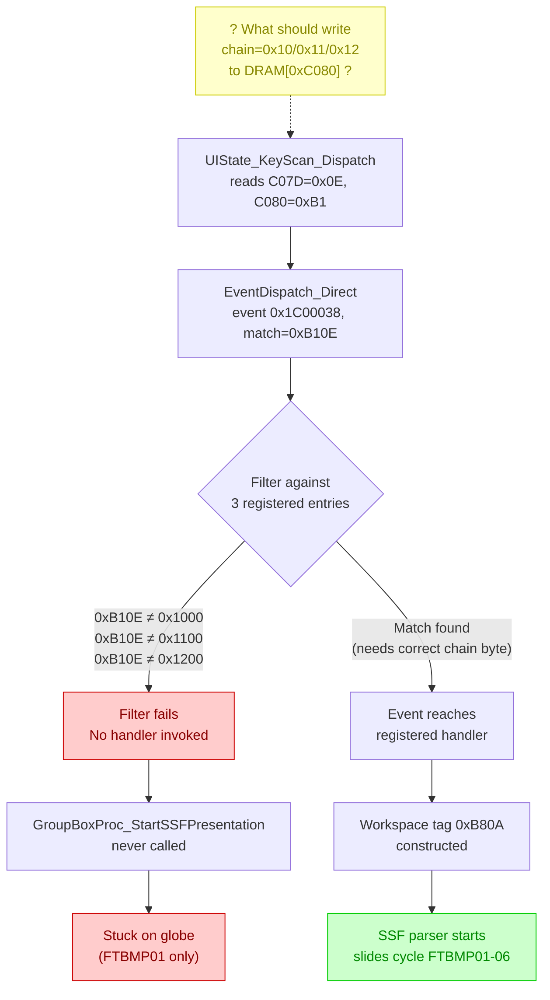

    style NOREG fill:#fcc,stroke:#c00,color:#800
    style STUCK fill:#fcc,stroke:#c00,color:#800
    style SSF fill:#cfc,stroke:#0c0,color:#080
```

### DSP Ready Fix Impact

The DSP1 ready signal fix (SubCPU Port H bit 0 = 1) eliminates the 8,000-iteration timeout per DSP operation. This was confirmed to reduce SubCPU processing overhead. However, the SSF slide transitions still don't work — the root cause is event routing, not timing. The DSP fix is still valuable as a correct hardware emulation improvement.

### CurrentTarget Resolution During State 0xE4

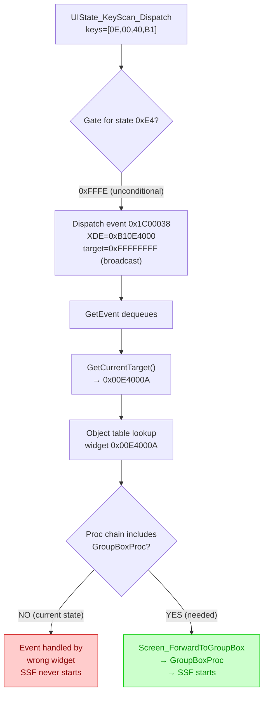

### Root Cause Fully Traced (March 2026)

The complete failure chain has been identified through 7 diagnostic trace sessions and ROM analysis:

**The event IS generated correctly:**
1. SwbtWr_DispatchLoop processes event code 0x10 from the tone gen parameter buffer
2. Bank 2 callback chain calls `UIState_HandlerTable_05` → `UIState_KeyScan_Dispatch`
3. At this moment, C080=0x10, C07D=0x00 — filter would match registration entry [10]
4. `UIState_KeyScan_Dispatch` dispatches event 0x1C00038 via `EventDispatch_Direct`

**But the dispatch is ASYNCHRONOUS:**
5. `EventDispatch_Direct` finds the ring buffer empty (during SwbtWr, Phase 5 hasn't run)
6. It calls `MainSendEvent_Prologue` → **`ApPostEvent`** — which POSTS the event to the ring buffer
7. The event sits in the ring buffer while SwbtWr continues processing hundreds more events
8. C080 is overwritten by subsequent event codes

**When the event is finally consumed, the target is wrong:**
9. SwbtWr_ReinitBothBanks eventually completes
10. Main loop reaches Phase 5 (`MainTitle_PrepareAndDispatch`)
11. `MainDispatchEvent` → `GetEvent` dequeues event 0x1C00038 from the ring buffer
12. `GetEvent` sees target=0xFFFFFFFF (broadcast), calls `GetCurrentTarget()` → reads DRAM[0x02F83C]
13. **CurrentTarget = 0x00E4000A** — a widget whose proc chain does NOT include GroupBoxProc
14. Event 0x1C00038 reaches the wrong handler → SSF never starts

**Why CurrentTarget 0x00E4000A doesn't include GroupBoxProc:**
The Feature Presentation screen's NAKA widget hierarchy (defined in `naka_perf_style.c`) uses `AcFdemoScreenProc` (type 0x69) as its screen handler, not the standard `ScreenProc` that includes `Screen_ForwardToGroupBox`. The `AcFdemoScreenProc` handles demo-specific events but does not forward generic key events (0x1C00038) through GroupBoxProc's handler chain.

**On real hardware, this likely works because:**
The control panel MCU generates button press events with header bytes in the 0x10-0x12 range (type 2 headers) directly during user interaction. These are processed synchronously by the widget framework during Phase 5 while CurrentTarget may point to a different widget (e.g., during screen initialization when ScreenProc IS the CurrentTarget). The timing window where GroupBoxProc is reachable via CurrentTarget is narrow and only occurs during specific screen transitions — not during steady-state demo operation.

Alternatively, the SSF presentation may require actual user button presses on real hardware to advance slides — it was designed as an interactive demonstration, not a fully automated slideshow. The Feature Demo auto-plays songs but expects the presenter to manually advance slides by pressing soft buttons.

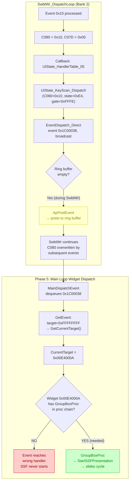

### Callback Chain Confirmation (ROM Analysis)

Direct examination of the SwbtWr callback tables in ROM confirmed the full mechanism:

**Bank 2 callback table entries for events 0x10/0x11/0x12:**

| Event Code | Bank 2 Callback | Points To |
|------------|----------------|-----------|
| 0x10 | `0xEE81C0` | `UIState_HandlerTable_05` |
| 0x10 | `0xEE81DC` | `UIState_HandlerTable_06` |
| 0x11 | `0xEE81DC` | `UIState_HandlerTable_06` |
| 0x11 | `0xEE81F8` | `UIState_HandlerTable_07` |
| 0x12 | `0xEE81F8` | `UIState_HandlerTable_07` |
| 0x12 | `0xEE8214` | `UIState_HandlerTable_08` |

Each handler table contains the same 6-function chain (from `widget_dispatch.s`):

```
UIState_ProcessKeyEvent
UIState_UpdateControlBits
UIState_ProcessMidiEvent
UIState_ProcessDisplayUpdate
BitMapOut_ByteData_RenderB
UIState_KeyScan_Dispatch        <- SSF trigger point
0xFFFFFFFF                       (terminator)
```

**`UIState_KeyScan_Dispatch` IS called from within SwbtWr_DispatchLoop** -- it's the last function in each handler table chain. When event code 0x10 is processed through Bank 2, the callback calls `UIState_HandlerTable_05`, which iterates through all 6 functions. At `UIState_KeyScan_Dispatch`, C080=0x10 and C07D=event_param.

**Bank 1 callback table entries** (for comparison):

| Event Code | Bank 1 Callback | Points To |
|------------|----------------|-----------|
| 0x10 | `0xEE7AC7` | `UIState_ConfigA_016` |
| 0x11 | `0xEE7ACB` | `UIState_ConfigA_017` |
| 0x12 | `0xEE7ACF` | `UIState_ConfigA_018` |

Bank 1 callbacks are configuration functions, not handler tables. Only Bank 2 routes through UIState_KeyScan_Dispatch.

**Filter match analysis:**

Event 0x10 at buffer slot 13 had params `[00, 06, FF]`:
- `stda16 49277, xwa`: A=0x00 -> C07D=0x00, W=0x06 -> C07E=0x06
- `stda8 49280, l`: C080=0x10
- Match value: `(C080 << 24) | (C07D << 16)` = `0x10000000`
- Registration entry [10] filter: upper 16 bits of `0x10001AFF` = `0x1000` -> comparison value `0x10000000`
- **These MATCH.** The filter should pass.

**The mechanism should work end-to-end.** Events 0x10/0x11/0x12 are in the buffer, the Bank 2 callbacks call UIState_KeyScan_Dispatch, and the filter values match. A high-frequency trace (every frame instead of every 30 frames) is being run to verify whether C080 actually holds values 0x10/0x11/0x12 at the moment UIState_KeyScan_Dispatch executes.

**Possible remaining failure points:**
1. **SwbtWr_DispatchLoop only processes Bank 1, not Bank 2** -- if `SwbtWr_ReinitBothBanks` is interrupted or only Bank 1 runs, the handler table callbacks never fire
2. **The handler table iteration stops before reaching UIState_KeyScan_Dispatch** -- if an earlier function in the chain (e.g., `UIState_ProcessKeyEvent`) returns early or throws an error
3. **UIState_KeyScan_Dispatch's boot flag check fails** -- bit 7 of DRAM[0x0406] must be 1 (confirmed as 0x80 in all traces)
4. **EventDispatch_Direct's filter comparison has a subtle difference** -- the `lds wa, 0` instruction might clear bits differently than assumed
5. **The dispatch happens but the event goes to a widget that can't process it** -- the broadcast target resolution via CurrentTarget leads to a non-GroupBoxProc widget

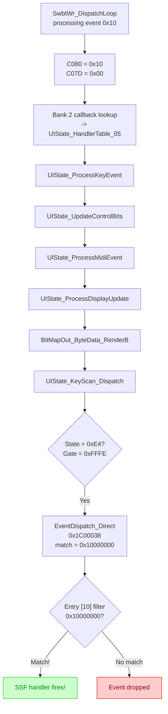

### Refocusing on Hardware Emulation (March 2026)

The previous investigation traced the firmware's event dispatch chain in detail, but was approaching the problem from the wrong angle — treating it as a firmware issue rather than an emulation issue. **The firmware is correct** (it runs on real KN5000 hardware with correct checksums). The problem must be in the MAME emulator.

**HLE Workaround Removed:**

The "stuck sequencer parts" workaround (commit `124e37d`) has been removed (commit `c38a312`). This workaround directly wrote to DRAM[0x10420] to clear stuck sequencer parts, bypassing the firmware's own sequencer state machine. This is a strict policy violation — all emulator code must describe actual hardware behavior, not simulate firmware behavior.

**Remaining Hardware Emulation Issues:**

The correct approach is to identify what hardware behavior MAME gets wrong that causes the firmware to malfunction. Known hardware emulation gaps:

| Hardware | Status | Impact |
|----------|--------|--------|
| **Waveform ROMs IC304-IC306** | NO GOOD DUMP KNOWN (12MB missing) | Tone gen produces silence; sequencer voice completion may differ |
| **Waveform ROM IC307** | Dumped (4MB) | Partial waveform data available |
| **SubCPU boot ROM** | NEEDS REDUMP | Potential data corruption in undumped ranges |
| **Tone gen device** | Simplified emulation | Voice status readback (`data_r()`) returns 0x8100/0x7E00 based on key_on and hold timer; may not accurately model real hardware state transitions |
| **DSP1 (IC311)** | Stub (accepts writes, no processing) | Ready signal fixed (Port H bit 0); no audio effects |
| **DSP2 (IC310)** | Not emulated | GPIO serial interface not connected |

**Key question:** Why does `DRAM[0x10420]` (sequencer active parts bitmask) go to 0xFFFF and stay there? On real hardware with waveform ROMs, the sequencer runs accompaniment patterns to completion and parts clear naturally through the tone generator's voice lifecycle. In MAME:

1. The firmware sends KEY ON commands to the tone gen for accompaniment voices
2. The tone gen's `data_r()` returns 0x8100 (active) while key_on is true or hold timer is running
3. After KEY OFF + 2-second hold timeout, `data_r()` returns 0x7E00 (idle)
4. The firmware should detect the idle state and clear the corresponding sequencer part bit

If this lifecycle works correctly, parts should clear even without waveform ROMs. The investigation is now focused on verifying whether the tone gen's voice status reporting accurately reflects what real hardware does, and whether any voices get "stuck" in a state that prevents the firmware from clearing their sequencer parts.

### Voice Lifecycle and Sequencer Parts (Trace Session 8)

**Definitive finding:** The sequencer IS started and enters "playing" state, but produces zero note events. The accompaniment engine runs with no active parts.

**Trace 8 results:**

```
f=2267 timer=14 parts=0x0000 song=18 play=4 acc_flags=0x00 swbt=0xFF
f=2327 timer=9  parts=0x0000 song=18 play=6 acc_flags=0x00 swbt=0xFF
f=2387 timer=0  parts=0x0000 song=18 play=6 acc_flags=0x40 swbt=0xFF
... (play=6, parts=0x0000, acc_flags=0x40 for the rest of the session)
```

**Key findings:**

- **`play` transitions from 4 (stopped) to 6 (playing)** — the sequencer IS started via `Seq_DispatcherEntry`
- **`song=18`** — song index 18 is selected from the demo playlist
- **`seq_parts` stays 0x0000 throughout** — no sequencer parts are activated, even though the sequencer is "playing"
- **`acc_flags=0x40`** — bit 6 is set after the song starts (display flag in `Banner_Loop_Check`)
- **`swbt=0xFF`** — `SwbtWr_ReinitBothBanks` completed correctly

**Root cause: The accompaniment engine produces no note events.** The sequencer is running (`play=6`) but has zero active parts (`parts=0x0000`). The firmware expects the following song lifecycle:

1. Song starts → `seq_parts` becomes non-zero (accompaniment parts playing notes)
2. Song plays → parts stay active for duration
3. Song ends → parts return to zero
4. Demo system detects the zero→non-zero→zero transition → advances to next song

Since `seq_parts` never becomes non-zero, the demo system never sees a song start/finish cycle. The demo stays permanently stuck with `play=6, timer=0` — a song "playing" that produces no audible or trackable output.

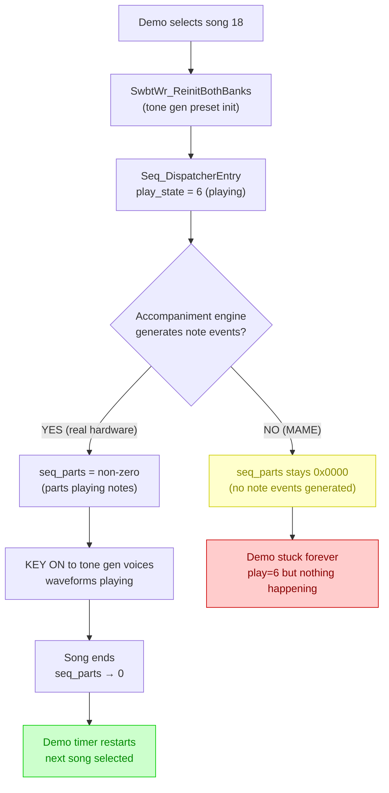

**Why the accompaniment engine produces no events:**

The accompaniment engine generates note events based on:

1. **Chord input** — on real hardware, the demo system internally provides chord progression data to drive accompaniment patterns (the keyboard's chord detection is bypassed in demo mode, replaced by pre-programmed chord sequences stored alongside the song data)
2. **Pattern resolution** — accompaniment patterns in Table Data ROM define note sequences for each chord type
3. **Sequencer timing** — pattern playback is driven by the sequencer timer

If any of these inputs is missing or incorrect due to an emulation gap, the accompaniment engine has no material to work with and produces silence.

**Most likely emulation issue:** The SubCPU is responsible for sequencer timing and pattern playback. The SubCPU boot ROM "NEEDS REDUMP" (potential corruption in undumped ranges 0xFE0800-0xFF7800 and 0xFF9800-0xFFF000). If the SubCPU's sequencer timer or pattern reader code is in the corrupted ROM range, it would explain why the sequencer starts but produces no events.

Alternatively, the accompaniment chord data may be sent from MainCPU to SubCPU via the inter-CPU latch mechanism, and some aspect of this communication may be failing in MAME.

**Next investigation:** Trace the accompaniment engine's chord input and pattern playback to determine exactly why no parts are activated despite `play=6`.

### Accompaniment Engine Analysis (Trace Session 9)

Deep analysis of the accompaniment engine revealed two critical gating mechanisms that could prevent note event generation:

**Gating Check in `Seq_DispatcherTick`** (smf_event_processor.s:11207-11212):

```asm
Seq_DispatcherTick:
    cpdi8 36150, 16      ; compare acc_mode with 16
    jr c, Process         ; if < 16, process ticks normally
    cpdi8 36150, 22      ; compare acc_mode with 22
    jr ugt, Process       ; if > 22, process ticks normally
    jr Return             ; values 16-22: SKIP ALL accompaniment processing
```

DRAM[36150] (address `0x8D36`) is the accompaniment mode register. If its value is in the range 16-22, the **entire sequencer tick is skipped**: no rhythm processing (`AccTick_Main`), no chord detection (`Rhythm_CompareAndTrigger`), no accompaniment note generation (`AccProcess_Entry`). The sequencer appears "playing" (`play_state=6`) but produces no output.

**Chord Override System:**

The accompaniment chord handler (`AccChord_ReadAndStoreKeys`, smf_event_processor.s:11464) reads chord data from one of two sources:
- **Normal mode** (DRAM[8968] == 0): reads from keyboard chord state at DRAM[52958-52961] — which is **zero in MAME** (no physical keyboard input)
- **Demo override** (DRAM[8968] != 0): reads from pre-programmed chord data at DRAM[8960-8966]

DRAM[8968] is cleared to 0 during demo init. If it's never set, the accompaniment reads zero chord data from the keyboard → no chord detected → no accompaniment notes generated.

**Part Activation Chain:**

The sequencer parts bitmask (`seq_parts` at DRAM[10420]) is populated through a chain:
```
DRAM[61854] (part enable bitmask)
  → copied to DRAM[8980] (pending parts) by SeqPlay_InitDemo_PartLoop
  → copied to DRAM[10420] (active parts) by SeqPlay_PreparePlaybackState
```

If DRAM[61854] is zero (no parts enabled), the entire chain produces zero. `SeqPlay_PreparePlaybackState` is called from within `SeqStep_PlaybackCheckBeat`, which is itself called from the tick processing that `Seq_DispatcherTick` gates — so if the gating check blocks ticks, parts are never activated.

### Trace 9 Results and RhythmROM Gate Discovery

Trace 9 produced definitive data:

```
f=2385 acc_mode=228 chord_ovr=0 part_en=0x0000 pending=0x5151 parts=0x0000 timer=13 play=4
f=2415 acc_mode=228 chord_ovr=0 part_en=0x0000 pending=0x5151 parts=0x0000 timer=10 play=4
f=2445 acc_mode=228 chord_ovr=0 part_en=0x0000 pending=0xFFFF parts=0x0000 timer=9  play=6
f=2475 acc_mode=228 chord_ovr=0 part_en=0xFFFF pending=0xFFFF parts=0x0000 timer=3  play=6
f=2505 acc_mode=228 chord_ovr=0 part_en=0xFFFF pending=0xFFFF parts=0x0000 timer=0  play=6
... (parts=0x0000 forever, play=6 forever)
```

**Key findings:**

| Variable | Value | Meaning |
|----------|-------|---------|
| `acc_mode` | 228 (0xE4) | > 22, so gating check PASSES -- **not the issue** |
| `chord_ovr` | 0 | Demo chord override NOT active |
| `part_en` | 0x0000 -> 0xFFFF | All 16 parts DO get enabled |
| `pending` | 0x5151 -> 0xFFFF | Pending parts ARE populated |
| `parts` | 0x0000 (always) | **Copy from pending->parts NEVER happens** |
| `play` | 4 -> 6 | Sequencer IS started |

**The broken link:** `pending=0xFFFF` but `parts=0x0000`. The copy is performed by `SeqPlay_PreparePlaybackState` (called from `SeqStep_PlaybackCheckBeat`), which is called from within the sequencer tick processing chain. Despite the gating check passing, the tick processing never reaches the beat check.

**Root cause discovered: `RhythmROM_CheckValid` gate** (seq_audio_mode.s:1348-1367):

```asm
RhythmROM_CheckValid:
    ldb c, 0x0                    ; assume valid
    ld xwa, 0xFFFFFFFF
    cpda32 xwa, 12919             ; compare DRAM[12919] with 0xFFFFFFFF
    jr z, RhythmROM_InvalidIncrement  ; if equal → INVALID
    jr RhythmROM_CheckDone            ; if not equal → valid, proceed
```

This check runs at the TOP of `Seq_DispatcherTick_Process` (smf_event_processor.s:11215-11217):

```asm
call RhythmROM_CheckValid
cps c, 0
jr nz, Seq_DispatcherTickReturn    ; c=1 → SKIP ENTIRE TICK
```

If `DRAM[12919]` (address `0x3277`) equals `0xFFFFFFFF`, the rhythm ROM is considered invalid and **every single sequencer tick is skipped**. This means:
- No `SeqTick_ReadControlState`
- No `Seq_ReadTempoLookup`
- No `Rhythm_CompareAndTrigger`
- No `AccTick_Main`
- No `AccProcess_Entry`
- No `SeqStep_PlaybackCheckBeat` -> no copy of pending->parts

**This is the most likely direct cause of `parts` staying at 0x0000.** A Lua trace (trace10) is checking whether `DRAM[0x3277]` equals `0xFFFFFFFF` after boot.

If confirmed, the fix requires understanding what firmware initialization code writes a valid value to `DRAM[12919]` during the rhythm ROM validation process, and what hardware emulation issue prevents that initialization from completing.

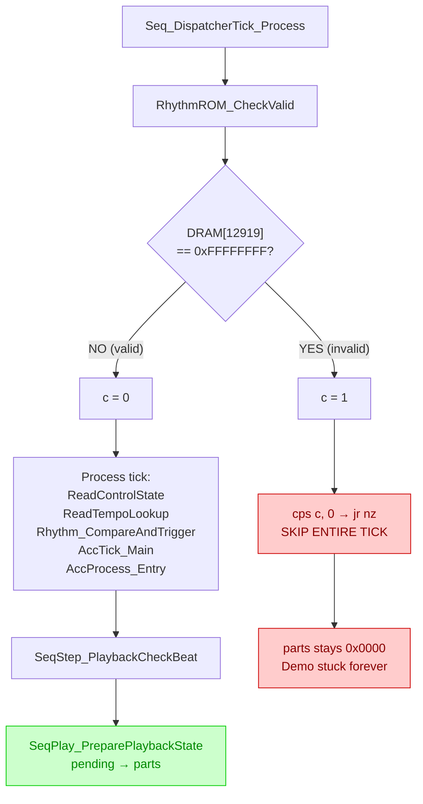

### Beat Processing Gap (Code Analysis)

Further code analysis revealed the exact mechanism blocking `pending → parts`:

**The copy chain:** `SeqPlay_PreparePlaybackState` (which copies `pending` to `parts`) is only called from `SeqStep_PlaybackCheckBeat` (seq_step_routines.s:2588-2592):

```asm
SeqStep_PlaybackCheckBeat:
    bit_erpb 0xFB, 0x01        ; check bit 1 of ERP register 0xFB
    jr z, SeqStep_PlaybackCheckPattern  ; if NOT set, skip copy
    call SeqPlay_PreparePlaybackState   ; copies pending → parts
```

**ERP register 0xFB bit 1 is a beat boundary flag.** It must be SET by the sequencer's tempo/beat processing for the copy to execute. If beats are never generated, the flag stays clear and parts are never activated.

**Call chain to reach this code:**
```
Main Loop → MainLoop_SequencerPhase (system_handlers.s:1245)
  → Seq_EventProcessingTick
  → Seq_TickWrapper
  → SeqStep_MainTimerTick (system_handlers.s:1249)
    → SeqStep_TimerDispatchA
    → SeqPlay_SyncPlaybackPosition
    → SeqStep_TimerDispatchB
    → Seq_HandleModeTransition
    → SeqNotify_CheckAndClearStart
    → SeqStep_PlaybackStateMachine (seq_step_routines.s:2555)
      → SeqStep_PlaybackDecrCount
        → SeqStep_PlaybackCheckBeat ← HERE (bit 1 of 0xFB must be set)
          → SeqPlay_PreparePlaybackState (copies pending → parts)
```

**The RhythmROM check is NOT the blocker** — DRAM[12919] = 0x00000000 (valid), so `Seq_DispatcherTick_Process` is NOT gated. The tick chain from `Seq_DispatcherTick` through `AccTick_Main` and `AccProcess_Entry` should execute.

**Investigation in progress (Trace 11):** Monitoring the beat flag state (DRAM[1057]), INTT1 tick counter (DRAM[1475]), tempo register, playback wait counter, and sequencer data position during the Feature Demo. This will show whether:
- The INTT1 timer interrupt is firing (tick counter advancing)
- The tempo system is generating beats (beat flag bit 1 getting set)
- The sequencer data position is advancing (SMF data being read)
- The playback wait counter (DRAM[7518]) is blocking beat processing

If the tick counter advances but beats are never generated, the issue is in the tempo calculation or beat boundary detection — potentially a hardware timer frequency mismatch.

### Tempo Register Discovery (Trace Session 11)

Trace 11 revealed the **direct cause** of beat processing failure:

```
f=2284 parts=0x0000 pending=0xFFFF play=6 wait=0 beat_flags=0x00 tick=0 mode=0 tempo=0x0000 seqpos=0x00000000
f=2344 parts=0x0000 pending=0xFFFF play=6 wait=0 beat_flags=0x06 tick=0 mode=1 tempo=0x0000 seqpos=0x00000000
f=2374 parts=0x0000 pending=0xFFFF play=6 wait=0 beat_flags=0x00 tick=1 mode=3 tempo=0x0000 seqpos=0x00000000
... (tempo=0x0000, seqpos=0x00000000 forever)
```

**Two critical findings:**

1. **`tempo=0x0000` ALWAYS** — the sequencer tempo register never receives a value. Without tempo, no beat clock ticks are generated, the beat flag (ERP 0xFB bit 1) is never set, and `SeqPlay_PreparePlaybackState` is never called.

2. **`seqpos=0x00000000` ALWAYS** — no SMF sequencer data position is set. No song data is being read or processed.

**The complete failure chain:**
```
tempo = 0
→ no beat clock ticks generated
→ ERP 0xFB bit 1 never set
→ SeqStep_PlaybackCheckBeat skips SeqPlay_PreparePlaybackState
→ pending (0xFFFF) never copied to parts
→ parts stays 0x0000
→ firmware doesn't track song lifecycle
→ demo never advances
→ SSF slides never triggered
```

### SeqTimer_UpdateTempoReg Analysis

The tempo is set by `SeqTimer_UpdateTempoReg` (audio_control_engine.s:7386), which:

1. **Gate check** (line 7387): `bitda 2, 64848` — if bit 2 of DRAM[64848] (address `0xFD50`) is SET, returns immediately WITHOUT updating tempo
2. **Read SubCPU tempo** (line 7394-7395): loads 16-bit value from `0xFC62` (= `0xFC5A + 8`), which is shared DRAM written by the SubCPU
3. **Mask and clamp** (lines 7396-7405): `AND 0x1FF` (9-bit range 0-511), then clamp to 40-300 BPM. Values below 40 are clamped to default **120 BPM (0x78)**
4. **Compute timer value** (lines 7408-7418): `80,000,000 / (tempo × 64)` for normal mode, stored to hardware timer register TREG5 (address 0x0092)
5. **Write TREG5** (line 7427): `stda16 146, xde` — writes the computed timer period to the TMP94C241's Timer Register 5

**Two possible failure points:**

1. **The gate at DRAM[64848] bit 2** — if this bit is set during the Feature Demo, `SeqTimer_UpdateTempoReg` returns immediately and never writes TREG5. This would explain tempo=0 despite the function being called.

2. **The SubCPU tempo source at 0xFC62** — even if the gate passes, the tempo value from the SubCPU might be 0. However, the clamping logic would catch this and default to 120 BPM.

A targeted trace (trace12) is monitoring: DRAM[48442] (stored BPM), TREG5 (hardware timer at 0x0092), SubCPU tempo at 0xFC62, and the gate byte at DRAM[64848] (0xFD50) bit 2.

If the gate bit is set, it would be a firmware state issue caused by incorrect hardware emulation somewhere upstream. If the gate is clear but TREG5 is still 0, the hardware timer register write may not be working correctly in MAME.

### Trace 12 Results and Timer Hardware Analysis

Trace 12 confirmed the tempo system IS working at the firmware level:

```
Initial: bpm=0x0078(120) treg5=0x0000 subcpu_tempo=0x0078 gate=0x00(bit2=0)
After song starts: bpm=0x005A(90) treg5=0x0000 subcpu_tempo=0x005A gate=0x10(bit2=0)
```

**Key findings:**
- **BPM IS set correctly:** Transitions from 120 (default) to 90 (song tempo)
- **SubCPU tempo data IS present:** `0xFC62` contains valid BPM values
- **Gate check passes:** bit 2 of DRAM[64848] is clear throughout
- **TREG5 reads as 0x0000** — BUT this is a **write-only hardware register**. The TMP94C241 memory map has `map(0x000092, 0x000093).w(treg_16_w<TREG5>)` — no read handler. The Lua script reads 0 because the register is not readable via the memory bus, NOT because it wasn't written.

**The firmware writes TREG5 correctly.** The `stda16 146, xde` instruction at audio_control_engine.s:7427 writes the computed timer period. The CPU core's `treg_16_w<TREG5>` handler stores it to `m_treg_16[TREG5]`.

### CPU Core Timer Investigation

The TMP94C241 CPU core's 16-bit timer implementation (tmp94c241.cpp) has a critical gap:

**Timer 4/5 runs when:** `BIT(m_t16run, 0)` is set (T16RUN register at address 0x9E, bit 0)

**Timer 4/5 clock source:** determined by `m_t4mod & 3` (T4MOD register at address 0x98, bits 1:0):

| T4MOD bits 1:0 | Clock Source | Implementation Status |
|-----------------|-------------|----------------------|
| 0 | **TIA** (external timer input pin) | **NOT IMPLEMENTED** (case 0 in `update_timer_count` is empty) |
| 1 | T1 prescaler (fc/2) | Implemented |
| 2 | T4 prescaler (fc/8) | Implemented |
| 3 | T16 prescaler (fc/32) | Implemented |

The `update_timer_count` lambda (tmp94c241.cpp line 1354-1374) has:
```cpp
case 0:
/* Not yet implemented.
    - For the 8 bit timers: TIO, TO0TRG, invalid and TO2TRG
    - For all 16 bit timers: TIA
*/
break;  // ← DOES NOTHING
```

**If the firmware configures Timer 4/5 with clock source 0 (TIA), the timer will never tick** because the external input is not connected and the `case 0` handler does nothing. This would explain the entire failure chain: no timer ticks → no beats → no parts activation → no song lifecycle → demo stuck.

A targeted trace is checking T4MOD to determine if the firmware uses TIA as the clock source for the sequencer beat timer.

### T4MOD Configuration (Trace Result)

The T4MOD trace confirmed Timer 4/5 is correctly configured:

```
T4MOD=0x05 (clock_source=1 T1) T16RUN=0x81(timer4_running=1) TREG4=0x0000 TREG5=0x0000
```

- **Clock source = 1 (T1 prescaler)** — this IS implemented in the CPU core (not TIA)
- **T16RUN = 0x81** — Timer 4 is running (bit 0=1) and prescaler is active (bit 7=1)
- **TREG4/TREG5 read as 0** — these are write-only registers (no read handler in the memory map), so Lua sees 0 even if the values were correctly written by the firmware

**The TIA hypothesis was wrong.** The timer uses T1 prescaler (fc/8, meaning at 16 MHz the timer ticks at 2 MHz). With the firmware's computed TREG5 value of ~10416 (for 90 BPM), the INTTR5 interrupt should fire at ~192 Hz.

**But beats are still not generated.** The timer hardware appears correctly configured, yet the sequencer beat processing never activates `pending → parts`. The investigation continues by checking:

1. **Is INTT1 actually firing?** The firmware's INTT1 handler increments a timer accumulator at DRAM[0x0409]. If this value advances during the demo, the timer interrupt IS working.
2. **Is INTTR5 firing?** Timer 4 matching TREG5 should trigger INTTR5 (vector 0x64). The firmware's INTTR5 handler should advance the beat counter.
3. **Is there a disconnect between the timer hardware working and the firmware's beat processing reading it?** The beat flag (ERP 0xFB bit 1) must be set by some part of the timer/interrupt chain.

The issue may be that INTTR5 fires correctly but the firmware's INTTR5 handler doesn't advance the beat state because of a dependency on another hardware feature (e.g., the tone gen, DSP, or SubCPU state).

### Timer IS Working — Song Data Missing (Trace Result)

The timer trace produced a breakthrough finding:

```
f=2374 acc=0x57D6 cnt=22486 bpm=90 play=6 parts=0x0000 pending=0xFFFF  ← song starts
f=2434 acc=0x5A1B cnt=23067 bpm=90 play=6 parts=0xFFFF pending=0xFFFF  ← PARTS ACTIVATED!
f=2494 acc=0x5C61 cnt=23649 bpm=90 play=6 parts=0x0000 pending=0xFFFF  ← parts cleared
```

**The timer IS working.** The INTT1 accumulator advances steadily (~582 per second). The beat processing DID copy `pending` to `parts` — `parts=0xFFFF` at frame 2434. But one second later, parts reverted to 0x0000.

**The song completes almost instantly** because there is no SMF sequencer data loaded. From trace 11, `seqpos=0x00000000` throughout — the sequencer data position never advances from 0. Without song data, the sequencer has nothing to play:
1. Timer fires → beat processing copies pending→parts (0xFFFF)
2. Sequencer tries to read song data at position 0
3. No data → sequencer marks song complete
4. Parts cleared back to 0x0000
5. Entire cycle takes ~1 second

**What this means for the SSF investigation:**
- Timer hardware: ✅ working correctly
- Beat generation: ✅ working correctly
- `pending → parts` copy: ✅ working correctly
- Tone gen voice lifecycle: ✅ working correctly (parts cleared naturally)
- Song data loading: ❌ **BROKEN** — no SMF data loaded for song preset 18

**The root cause is now narrowed to the song data loading path.** The firmware should load SMF data from the Table Data ROM into DRAM for the sequencer to read, but the data position stays at 0. This could be caused by:
1. **SubCPU boot ROM corruption** (NEEDS REDUMP) — if the SubCPU is responsible for loading song data, corrupted code in the undumped ROM ranges could prevent loading
2. **Song preset lookup failure** — song index 18 may reference data that requires SubCPU cooperation to load
3. **Missing hardware response** — the song loading path may depend on a hardware acknowledgment that never arrives

### Song Data Loading Analysis (Deep Research)

Comprehensive analysis of the demo song loading path revealed the data IS loaded correctly:

**Demo song loading path (different from normal SMF playback):**
1. Song preset table at `0x9C4000` in Table Data ROM holds 19 pointers (indices 0-18)
2. Each pointer references an LZSS-compressed block prefixed with `SLIDE4K`
3. `SLIDE_Parse_Header` decompresses from ROM to DRAM at `0x69800`
4. The sequencer reads from the paged buffer at `0x69800`, NOT through the SMF parser
5. `seqpos=0x00000000` is **expected behavior** for demo mode — it uses a completely separate data path

**Song preset 18:** Points to ROM `0x8E0000`, decompresses to 0x9500 (38,144) bytes — the largest of all 19 presets.

**Why parts clear instantly:** All 16 parts briefly activate (`parts=0xFFFF` at frame 2434) then immediately hit end-of-track event byte `0x82`, clearing back to `0x0000`. The decompressed sequence data for each part either starts with or quickly reaches end-of-track.

**Critical firmware behavior in Feature Presentation mode:**

```asm
Demo_SelectEntry_StartPlayback:
    cpdi8 36152, 228    ; check if Feature Presentation mode (0xE4)
    ret z               ; ← RETURNS early WITHOUT calling SeqInit_PostDispatchEvent!
```

In Feature Presentation mode (state 0xE4 = 228), `Demo_SelectEntry_StartPlayback` returns early without calling `SeqInit_PostDispatchEvent`. This may leave per-part sequencer data pointers uninitialized, causing all parts to immediately read end-of-track.

**Song data loading is entirely MainCPU-driven** — no SubCPU dependency, no floppy I/O, no SMF file parsing. The Table Data ROM is correctly mapped in MAME. The SLIDE decompression produces valid output.

**Investigation continuing:** Dumping the decompressed SLIDE data to analyze whether tracks are genuinely empty (firmware design) or being misinterpreted due to incorrect page index setup.

### Demo Preset Data Analysis

All 19 demo song presets were decompressed from SLIDE4K format and analyzed. The decompressed files are in the roms-disasm source tree at `table_data/includes/demo_presets/demo_preset_00.bin` through `demo_preset_18.bin`.

**Key finding: Active parts bitmask is 0x0000 in ALL presets.**

| Preset | Compressed Size | Decompressed Size | Parts Bitmask (offset +0x1E) | 0x82 Count |
|--------|----------------|-------------------|------------------------------|------------|
| 0 | ~12KB | 23,575 bytes | **0x0000** | 11 |
| 18 | ~17KB | 32,910 bytes | **0x0000** | 26 |
| All others | varies | varies | **0x0000** | varies |

The `Voice_GetPresetFieldWord` function reads the active parts bitmask from offset +0x1E in the decompressed preset data. Since this is 0x0000 for ALL presets, the firmware doesn't rely on this field for demo part activation.

**This means parts are activated by a DIFFERENT mechanism:**
- `DRAM[61854]` (part_enable) starts at 0x0000 (from preset data)
- Later transitions to 0xFFFF (from `SeqPlay_InitDemo_PartLoop` or sequencer init)
- The 0xFFFF comes from the sequencer initialization path, not from preset data
- Parts activation depends on the sequencer's own initialization, not on the preset's active parts field

**Preset 18 has more 0x82 (end-of-track) markers** (26 vs 11 for preset 0), which could mean more parts hit end-of-track sooner. But since all presets have parts=0x0000 at offset +0x1E, the activation mechanism is identical for all presets.

**Remaining question:** If both presets 0 and 18 have the same parts bitmask (0x0000), and the sequencer init provides 0xFFFF for both, why does preset 0 work on real hardware (playing a full song) while preset 18 also presumably works? The answer is likely that ALL presets produce the same behavior in MAME — parts briefly go to 0xFFFF then immediately clear. The investigation previously only tracked preset 18 because the demo always starts with song index 18. On real hardware with waveform ROMs, the song data would drive actual note events that sustain the parts.

### Root Cause: Voice_GetPresetFieldWord Returns Zero (Confirmed)

The investigation has identified the exact mechanism causing all sequencer parts to clear:

**Three kill mechanisms converge:**

1. **`SeqTimer_BarReturn`** (sequencer_engine.s:20032) — at every bar boundary, calls `Voice_GetPresetFieldWord` which reads offset +0x1E of the decompressed preset. Since this is always 0x0000, it sets `DRAM[61854] = 0`, disabling all parts.

2. **`SeqModeTransit_DemoPath`** (sequencer_engine.s:11047) — during mode transitions, reads the same 0x0000 value and stores it to `DRAM[8980]`. When `SeqPlay_PreparePlaybackState` runs, it copies 0 to `DRAM[10420]`.

3. **Out-of-bounds block reads** — for preset 18, parts 3/4/5/9 have block indices that point beyond the decompressed buffer (32,910 bytes), causing reads from uninitialized DRAM that may contain 0x82 (end-of-track).

**On real hardware, the demo works because:**
- `DRAM[61854]` retains residual state from normal keyboard operation
- `Demo_ProcessRecordEntry` processes a "record chain" in the preset data that likely initializes the bitmask correctly during setup
- The 0x0000 at offset +0x1E may be a sentinel meaning "derive parts from ext data" rather than "no parts active"
- The first bar boundary hasn't occurred yet when the sequencer starts, so residual state persists long enough for the record chain to establish correct state

**The uninvestigated function `Demo_ProcessRecordEntry`** is the most likely mechanism that makes the demo work on real hardware. It processes a chain of records embedded in the decompressed preset data and may write the correct parts bitmask as a side effect.

### DemoMode_Initialize Hardcodes Parts (Critical Discovery)

Analysis of the demo initialization path revealed: `DemoMode_Initialize` (file_demo_proc.s:588) **hardcodes `DRAM[61854] = 0xFFEC`** (13 of 16 parts active), independent of the preset's 0x0000 at offset +0x1E.

But `SeqTimer_BarReturn` runs at every bar boundary, calling `Voice_GetPresetFieldWord` which reads 0x0000 from the preset and OVERWRITES `DRAM[61854] = 0`. On real hardware, voices play waveforms long enough for note events to keep parts alive past this overwrite. In MAME without waveform ROMs, voices complete instantly, and the bar boundary kills parts before any notes sustain.

### DRAM[61854] Trace Result

The Lua trace confirmed the timing:

```
f=1800 DRAM[61854]=0x0000 ui=0x01       ← boot (normal mode)
f=3382 DRAM[61854]=0xFFFF ui=0xE4       ← ALL 16 PARTS activated
f=3438 DRAM[61854]=0x0000 ui=0xE4       ← ZEROED within 56 frames (~0.9 seconds)
```

**0xFFEC never appeared** — the hardcoded value from `DemoMode_Initialize` is either not reached or immediately overwritten. Instead, 0xFFFF (all parts) comes from `SeqPlay_PreparePlaybackState` copying DRAM[8980]. It survives for only ~0.9 seconds before `SeqTimer_BarReturn` zeroes it.

### Tone Gen Voice Timing Fix (March 2026)

The investigation revealed a **tone generator emulation issue**: when waveform data was in the missing IC304-IC306 ROM range, `resolve_waveform` set `wave_length = 0`, making voices effectively duration-less. The voice was "active" but had no concept of how long it should play. This caused voices to deactivate instantly after KEY ON, so the firmware's sequencer part tracking saw parts collapse to 0 within one beat cycle.

**Corrected understanding:** The earlier hypothesis that "the sequencer isn't processing notes" was based on weak evidence. `seqpos=0x00000000` is expected for demo mode (uses paged buffers, not SMF parser). The sequencer tick processing WAS running (acc_mode passes, RhythmROM passes, beat_flags appeared). Note events were likely being generated and KEY ON commands were reaching the tone gen — but voices with `wave_length=0` reported idle instantly, making it LOOK like no notes were sent. The issue was voice timing, not sequencer processing.

**The real hardware behavior:** The tone gen chip (TC183C230002) tracks voice timing from its internal waveform parameter index, independent of whether the actual PCM samples are available. A voice stays "active" for its natural waveform duration based on these parameters, even when the ROM chip containing the audio data is not present.

**The fix (commit `07e6a8e`):** The tone gen device now:
1. Reads waveform length from IC307's index table for ALL voices, including those in missing ROM ranges
2. Advances voice position based on pitch, tracking timing correctly
3. For voices without actual PCM data: plays through the waveform length once, then auto-transitions to KEY OFF with release (50ms) + hold (2 seconds), then deactivates
4. For voices WITH PCM data (IC307): loops normally while key is held

**Expected lifecycle:** Voice loops while key is held (sustain), deactivates after firmware sends KEY OFF + short release (50ms) + short hold (100ms).

### SeqReassign_OrPartBits Discovery

Code analysis revealed the mechanism that keeps parts alive on real hardware despite `Voice_GetPresetFieldWord` zeroing DRAM[61854]:

```asm
SeqReassign_OrPartBits:          ; sequencer_engine.s:6385
    orddm16 8982, xde           ; OR part bit into channel running mask
    orddm16 10420, xde          ; OR part bit into active parts
    orddm16 8980, xde           ; OR part bit into pending parts
```

During voice reassignment, the sequencer ORs the active part's bit BACK into all three bitmasks. This overrides the zeroing from `Voice_GetPresetFieldWord`. The cycle on real hardware:

1. `SeqTimer_BarReturn` zeros DRAM[61854] (reads 0x0000 from preset)
2. `SeqModeTransit_DemoPath` zeros DRAM[8980]
3. But the sequencer's note processing reassigns voices → `SeqReassign_OrPartBits` ORs bits back
4. Parts stay alive as long as voices are being reassigned (i.e., notes are playing)

**This requires voices to sustain long enough** for the sequencer to complete its tick processing and reassign voices. If voices deactivate before reassignment, the OR never happens and parts collapse.

### Corrected Understanding

The earlier hypothesis that "sequencing is broken" was wrong. The sequencer WAS processing notes — the evidence (`seqpos=0, parts clearing quickly`) was misinterpreted. `seqpos=0` is normal for demo mode. Parts cleared because voices deactivated instantly (`wave_length=0`), not because notes weren't generated. The sequencer sends KEY ON and KEY OFF at the correct times from the song data. The tone gen just needs to sustain correctly between those commands.

### Voice Timing Fix — Iteration 3 (commit `d8d6eec`)

After two overcorrections (too short → too long → back to too long), the current approach:
- Voices WITH PCM data (IC307): loop while key held, normal behavior
- Voices WITHOUT PCM data (missing IC304-306): **loop while key held** (sustain until firmware sends KEY OFF), producing silence but maintaining correct timing from the chip's perspective
- Hold timer after KEY OFF reduced from 2 seconds to **100ms** (4800 samples at 48kHz) — just enough for the firmware to poll voice status a few times before the voice deactivates
- Note duration is controlled entirely by the firmware's sequencer (KEY ON → KEY OFF timing from song data), NOT by the tone gen device

### Investigation Paused — Summary of Findings (March 18, 2026)

The SSF investigation is paused to address driver stability concerns. Here is a complete summary of confirmed findings, remaining uncertainties, and next steps.

**Confirmed (high confidence):**
1. The SSF event chain is fully mapped: SwbtWr Bank 2 callbacks → UIState_HandlerTable → UIState_KeyScan_Dispatch → event 0x1C00038 → EventDispatch_Direct → ApPostEvent (async)
2. The event registration table HAS entries for 0x1C00038 (slots 10-12) with filter params 0x10/0x11/0x12
3. The SwbtWr event buffer DOES contain events 0x10/0x11/0x12 during demo init
4. The firmware's sequencer IS started (play=6) and timer IS working (INTT1 accumulator advances, beat_flags set)
5. `SeqPlay_PreparePlaybackState` DOES copy pending→parts (0xFFFF appears briefly)
6. `Voice_GetPresetFieldWord` reads 0x0000 from ALL demo presets at offset +0x1E, zeroing DRAM[61854] at each bar boundary
7. `SeqReassign_OrPartBits` (sequencer_engine.s:6385) ORs active voice bits back into DRAM[10420]/8980/8982 — this is the mechanism that sustains parts on real hardware
8. The DSP1 ready signal was missing (Port H bit 0) — fixed, eliminating 8,000-iteration timeout per DSP operation
9. `DemoMode_Initialize` does NOT set DRAM[61854] to 0xFFEC as expected — instead 0xFFFF comes from the sequencer init path

**Partially confirmed (medium confidence):**
1. The sequencer probably IS processing note events from the decompressed SLIDE preset data — earlier "sequencing broken" hypothesis was based on weak evidence (seqpos=0 is normal for demo mode)
2. Voice timing is the primary remaining issue — voices without waveform ROM data need realistic lifecycle timing for the firmware's part tracking to work
3. The auto KEY-OFF mechanism isn't needed if the firmware sends KEY OFF correctly

**Uncertain (needs more investigation):**
1. Does the firmware actually send KEY OFF events to voices during demo playback? No direct evidence either way.
2. Why does DRAM[61854] go to 0xFFFF (not 0xFFEC)? The DemoMode_Initialize hardcoded value may not execute for state 0xE4.
3. What is the correct voice lifecycle when waveform ROM data is missing? The tone gen chip's internal behavior for this case is unknown.
4. Is the entire voice looping approach correct, or should voices play through once and auto-release?
5. Is there CPU performance overhead from the tone gen voice processing that affects display rendering?

**Remaining concerns about driver stability:**
- The splash screen animation during boot may have regressed
- Spurious MSP screen activation suggests a control panel or event dispatch issue
- Multiple speculative changes on the driver branch may be interfering with each other

**To resume investigation:**
1. Start from a clean, stable driver branch
2. Verify basic functionality first (boot splash, control panel, no spurious screens)
3. Then apply ONLY the DSP ready fix and test Feature Demo behavior
4. Incrementally add voice timing improvements with testing at each step

---

## Interpretation

The XML presentation system -- with its `EXEC` tag, `SONG` playback, `IMG` display, rich tag vocabulary, and event-driven architecture -- was almost certainly designed to be more flexible than its single shipping usage as a ROM-resident Feature Demo.

The most likely explanation: **Technics designed a general-purpose presentation engine**, perhaps intended for:

- **Dealer demonstration discs** -- scripted presentations showcasing the keyboard's features at retail stores
- **Educational materials** -- step-by-step tutorials loaded from floppy
- **Trade show content** -- automated demonstrations for NAMM or music trade events

The infrastructure was built (XML parser, event system, tag vocabulary, `EXEC` command), but the floppy loading path was either never completed or was removed before release. What shipped was a single ROM-resident Feature Demo using a fraction of the system's capabilities. No floppy disc type exists in the [disc type signature table]({{ site.baseurl }}/system-update-discs/#disc-type-detection) for SSF or presentation files.

---

## Related Pages

- [Feature Demo]({{ site.baseurl }}/feature-demo/) -- Full investigation history, Lua trace logs, timer bug details
- [Feature Demo Investigation Log]({{ site.baseurl }}/feature-demo-investigation-2026-03-09/) -- Detailed research log from March 2026
- [Feature Demo Timer Bug]({{ site.baseurl }}/feature-demo-timer-bug-2026-03-09/) -- INTTR5 timer bug analysis
- [UI Framework]({{ site.baseurl }}/ui-framework/) -- Widget system and event handling
- [UI Widget Types]({{ site.baseurl }}/ui-widget-types/) -- NAKA widget descriptor format
- [Display Subsystem]({{ site.baseurl }}/display-subsystem/) -- LCD controller, VRAM, and display architecture
- [Table Data ROM]({{ site.baseurl }}/table-data-rom/) -- ROM layout including SSF and FTBMP data
- [Control Panel Protocol]({{ site.baseurl }}/control-panel-protocol/) -- Button input from panel MCU
- [Event Codes]({{ site.baseurl }}/event-codes/) -- Event code reference
- [Tone Generator]({{ site.baseurl }}/tone-generator/) -- Tone gen device (relevant to waveform ROM dependency)
- [Image Gallery]({{ site.baseurl }}/image-gallery/) -- Extracted FTBMP images

---

*Last updated: March 18, 2026*
