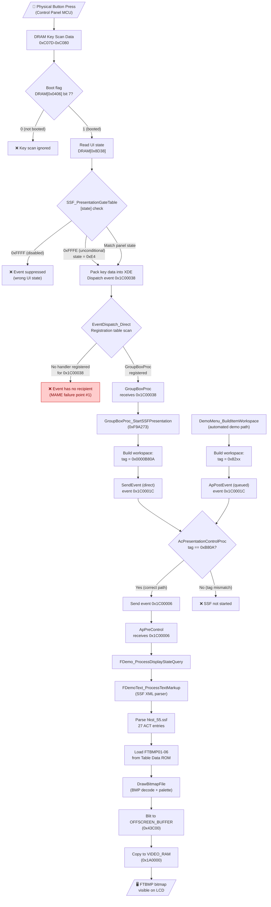
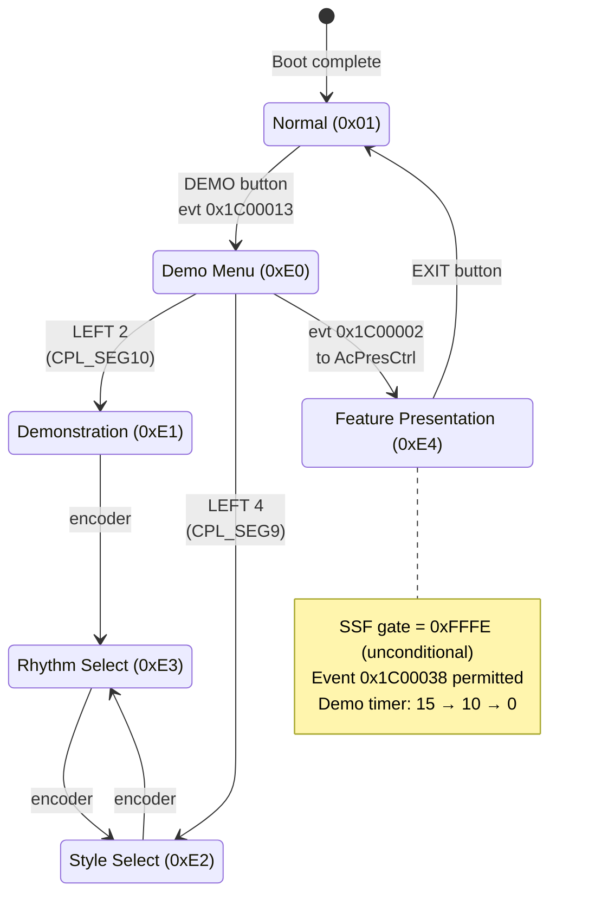
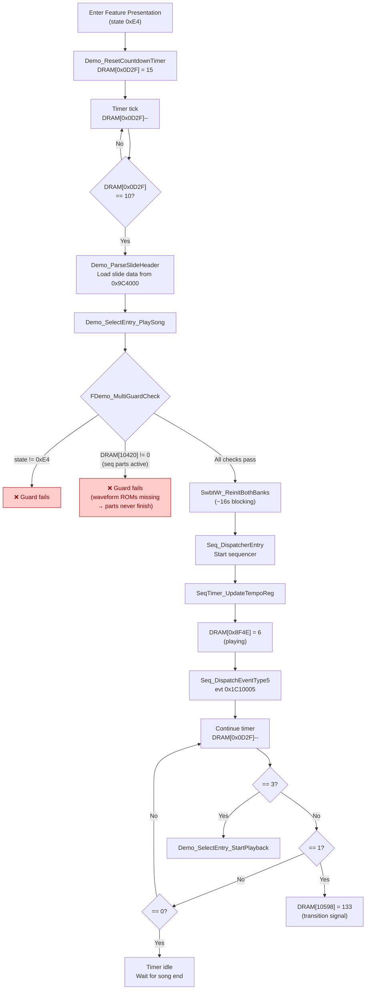
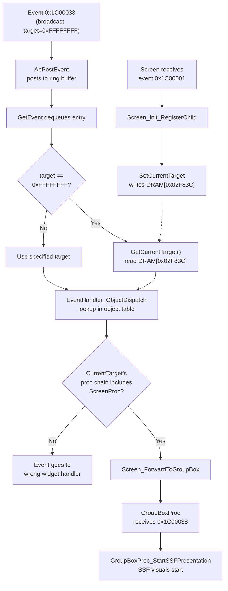

# SSF Presentation System

The KN5000 contains an XML-based **SSF (Sound Slide Film)** presentation system that drives the built-in Feature Demo mode. It displays a synchronized slideshow of FTBMP bitmap images (Technics globe, speaker system, floppy disks, surround sound diagram, KN5000 branding) alongside demo song playback. The system is orchestrated by an XML-like SSF script (`hkst_55.ssf`) stored in the Table Data ROM, which references named NAKA widget objects for each slide.

This page consolidates all research findings about the SSF system into a single reference. For the broader Feature Demo investigation (timer bugs, MAME emulation status, Lua trace logs), see the [Feature Demo]({{ site.baseurl }}/feature-demo/) page.

---

## Table of Contents

- [UI State Machine](#ui-state-machine)
- [Event Dispatch Chain](#event-dispatch-chain)
- [SSF Script System](#ssf-script-system)
- [FTBMP Image Format](#ftbmp-image-format)
- [Rendering Pipeline](#rendering-pipeline)
- [Demo Timer and Song Playback](#demo-timer-and-song-playback)
- [Key DRAM State Variables](#key-dram-state-variables)
- [Key Routines](#key-routines)
- [Known Bug: MAME SSF Never Activates](#known-bug-mame-ssf-never-activates)
- [Investigation Progress (March 2026)](#investigation-progress-march-2026)
- [Interpretation](#interpretation)

---

## UI State Machine

The Feature Demo operates within the KN5000's global UI state machine. The current UI state is stored as a byte at DRAM address `0x8D38` and is read by the getter function at `0xF0618F`.

### States

| State (DRAM `0x8D38`) | Name | Description |
|------------------------|------|-------------|
| `0x01` | Normal | Home screen, normal keyboard operation |
| `0xE0` | Demo Menu | Top-level DEMONSTRATION menu |
| `0xE1` | Demonstration | Demonstration/performances playing (song cycling active) |
| `0xE2` | Style Select | Style selection sub-menu within demo |
| `0xE3` | Rhythm Select | Rhythm selection sub-menu within demo |
| `0xE4` | Feature Presentation | Feature Presentation sub-menu (SSF trigger point) |

### Activation Button Sequence

From the home screen, the correct sequence to reach the Feature Presentation:

1. Press **DEMO** button -- `0x8D38` transitions `0x01` to `0xE0` (DEMONSTRATION menu appears)
2. Press **LEFT 4** (4th soft button from top, mapped to `CPL_SEG9`) -- `0x8D38` transitions `0xE0` to `0xE4` (FEATURE PRESENTATION sub-menu appears)
3. Press **LEFT 2** (2nd soft button from top, mapped to `CPL_SEG10`) -- `0x8D38` transitions `0xE4` to `0xE1` (demo begins playing)

State transitions are routed through `UI_PostModeChangeEvent`, which sends event `0x1C00015` to `SeqState_TransitionMode`.

### MAME Button Mapping Reference

| Button | MAME Input Port |
|--------|----------------|
| LEFT 1-2 | `CPL_SEG10` |
| LEFT 3-5 | `CPL_SEG9` |
| RIGHT 1-3 | `CPL_SEG8` |
| RIGHT 4-5 | `CPL_SEG7` |

Buttons are numbered top-to-bottom along the LCD edges.

---

## Event Dispatch Chain

The SSF presentation activation involves a 7-stage event dispatch chain, from physical button press to bitmap rendering. Understanding this chain is critical to diagnosing the MAME activation bug.

### Stage 1: Button Press to DRAM

A physical button press on the control panel is detected by the **Control Panel MCU** (a separate microcontroller). The MCU writes key scan data into shared DRAM, where the main CPU can read it. See [Control Panel Protocol]({{ site.baseurl }}/control-panel-protocol/) for the serial protocol details.

### Stage 2: UIState_KeyScan_Dispatch (0xF98697)

This function is the SSF event gatekeeper. It:

1. Checks bit 7 of DRAM `0x0406` (a boot-complete flag set by `Boot_DisplayScreen`; cleared only during flash updates)
2. Reads the current UI state byte `R` from DRAM `0x8D38`
3. Loads a ROM pointer `P = SSF_PresentationGateTable[0xE01F80 + R * 4]`
4. Walks the 16-bit state-value array at `P`, comparing each entry against the packed panel state `(DRAM[0xC080] << 8) | DRAM[0xC07D]`
5. If a match is found (or the array starts with the unconditional marker `0xFFFE`), packs key data into XDE and dispatches **event `0x1C00038`**

The gate table entry for state `0xE4` (Feature Presentation) contains the **unconditional marker** `0xFFFE`, meaning any key press in this state broadcasts `0x1C00038`.

### Stage 3: EventDispatch_Direct (0xFA9945)

The broadcast event router. It maintains a registration table in a ring buffer at DRAM `0x02BC34` (head/tail pointers at `0x02EC34`/`0x02EC36`). For each registered entry matching event code `0x1C00038`, it forwards the event to the registered handler widget.

### Stage 4: GroupBoxProc Receives 0x1C00038

`GroupBoxProc` is a UI container widget handler. Its event dispatch table includes:

```
cp xde, 0x1C00038
jrl z, GroupBoxProc_StartSSFPresentation
```

When `GroupBoxProc` receives `0x1C00038`, it routes directly to the SSF startup routine.

### Stage 5: GroupBoxProc_StartSSFPresentation (0xF9A273)

This is the critical function that constructs the SSF workspace:

1. Allocates a 12-byte workspace from the firmware heap
2. Builds the workspace bytes individually from stack-resident parameters: `workspace[0]=0x0A`, `workspace[1]=0xB8`, `workspace[2..3]=0x00` -- producing the **type-tag `0x0000B80A`**
3. Sends **event `0x1C0001C`** via direct `SendEvent` (`0xFA9660`)

The type-tag `0x0000B80A` is the magic value that identifies this workspace as an SSF presentation request.

### Stage 6: AcPresentationControlProc (0xF8450B)

The main presentation controller. When it receives event `0x1C0001C`, sub-handler `AcPresentCtrl_CheckSSFStart` (0xF84625) checks:

```
*(workspace_pointer) == 0xB80A ?
```

If the tag matches, it sends **event `0x1C00006`** to begin SSF parsing. If the tag does not match (as happens with the automated demo path's `0x82xx` tags), the SSF never starts.

### Stage 7: SSF Parser and Bitmap Rendering

Event `0x1C00006` triggers the SSF XML parser chain:

```
ApPreControl receives 0x1C00006
  -> FDemo_ProcessDisplayStateQuery
    -> FDemoText_ProcessTextMarkup
      -> DrawBitmapFile (bitmap render to VRAM)
```

The parser reads `hkst_55.ssf` from ROM, processes `<SHOW OBJ="...">` actions, and renders FTBMP bitmaps to the display.

### Full System Flowchart

The following flowchart shows the complete SSF activation path from button press to bitmap rendering, including all decision points and the two competing event paths (correct path via GroupBoxProc vs. automated path via DemoMenu). Red nodes indicate where the chain breaks in MAME.



### UI State Machine Flowchart



### Demo Timer and Song Playback Flowchart



### Rendering Pipeline Flowchart

```mermaid
flowchart LR
    BMP["FTBMP in Table Data ROM<br/>(BMP file, 8bpp indexed)"] --> HDR["Validate BMP header<br/>biSize=0x28, biBitCount≤8"]
    HDR --> PAL["Load 256-color palette<br/>→ OFFSCREEN_BUFFER_4<br/>(0x69400)"]
    PAL --> DECODE["Gfx_ProcessSplashData<br/>1bpp/4bpp/8bpp decode"]
    DECODE --> REMAP["Gfx_DecodeImageToBuffer<br/>Palette remap"]
    REMAP --> BUF1["Write to OFFSCREEN_BUFFER_1<br/>(0x43C00, 76800 bytes)"]
    BUF1 --> VRAM["Mem_Copy to VIDEO_RAM<br/>(0x1A0000)"]
    VRAM --> PALREG["ChangePalette_Impl<br/>Write VGA port 0x3C9"]
    PALREG --> LCD[/"320×240 8bpp LCD"/]
```



---

## SSF Script System

### SSF File Location

The SSF script is embedded in the Table Data ROM:

| File | Metadata Address | XML Data Address | Purpose |
|------|-----------------|------------------|---------|
| `hkst_55.ssf` | 0x87FFF0 | 0x88000E | Feature Demo presentation script |
| `hkt_87.ssf` | Near boot vectors | Unknown | Possibly a second presentation |

**Source file:** `roms-disasm/table_data/includes/hkst_55.ssf`

### Metadata Header (0x87FFF0)

```c
struct FeatureDemo_FileMetadata {
    char   filename[12];    // +0x00: "hkst_55.ssf"
    uint32 reserved;        // +0x0C: 0
    uint32 padding_ptr;     // +0x10: pointer to 2-byte padding (HKstSSF_Padding)
    uint32 xml_ptr;         // +0x14: pointer to XML data (0x88000E)
    uint32 entries_ptr;     // +0x18: pointer to file entries (0x8CE01C)
};
```

### XML Format

The script uses an XML-like markup language with a defined tag vocabulary:

```xml
<ACTION>
  <ACT NO=1><SHOW OBJ="ftdemo01"></ACT>
  <ACT NO=2><SHOW OBJ="ftdemo04"></ACT>
  <ACT NO=3><SHOW OBJ="ftdemo05"></ACT>
  ...
  <ACT NO=27><SHOW OBJ="ftdemo48"></ACT>
</ACTION>
```

The script defines **27 sequential actions**, each referencing a named NAKA widget object. Objects include `ftdemo01` through `ftdemo48` (bitmap resource references) plus interactive displays like `Accordion`, `Drawbar`, and `Sdmixer`.

### XML Tag Vocabulary

The firmware contains a complete XML tag name table in the Program ROM:

#### Structure Tags

| Tag | Close Tag | Purpose |
|-----|-----------|---------|
| `PRESENTATION` | `/PRESENTATION` | Top-level presentation wrapper |
| `ACTION` | `/ACTION` | Action sequence container |
| `ACT` | `/ACT` | Individual action step (with `NO=` attribute) |

#### Content Tags

| Tag | Close Tag | Purpose |
|-----|-----------|---------|
| `SHOW` | -- | Show/display a named UI object |
| `IMG` | -- | Display an image |
| `SONG` | -- | Play a song or MIDI sequence |
| `FONT` | `/FONT` | Font selection for text rendering |
| `CENTER` | `/CENTER` | Text centering |
| `BR` | -- | Line break |

#### Attribute and Command Tags

| Tag | Purpose |
|-----|---------|
| `SRC` | Source reference (file/resource) |
| `NAME` | Name identifier |
| `EXEC` | Execute a command or routine |

The `EXEC` tag is particularly notable -- it suggests the presentation format was designed for general-purpose use beyond simple slideshow display, supporting code execution as part of scripted presentations.

### Timer Events for Slide Transitions

Slide transitions within the SSF presentation are controlled by timer events:

| Event Code | Purpose |
|------------|---------|
| `0x1C10005` | Slide transition timer tick |
| `0x1C10006` | Slide transition complete |

### Widget Data

The NAKA widget system manages SSF UI elements. Widget data for the Feature Demo lives in `naka_perf_style.c`, which contains FTBMP filename strings and widget descriptor structures. The `ftdemo01`-`ftdemo48` names are bitmap resource references -- simple filename strings (e.g., `aligned_string "ftdemo43"`) that identify image resources loaded during the demo.

Interactive objects (`Accordion`, `Drawbar`, `Sdmixer`) are container objects with child sub-objects, handler procedures, and rendering routines. See [UI Widget Types]({{ site.baseurl }}/ui-widget-types/) for the widget descriptor format.

### Object Dispatch

When `AcPresentationControlProc` processes a `<SHOW OBJ="...">` action:

1. The XML parser extracts the OBJ name string
2. The name is matched against the `NAKA_UIObjectTable` (~141 entries)
3. For bitmap resources (`ftdemo01`-`ftdemo48`): extracts the filename pointer from the structure, looks up the file entry index, loads BMP data from ROM, renders to VRAM
4. For container objects (`Accordion`, `Drawbar`, `Sdmixer`): activates the interactive UI handler

The dispatch uses a **jump table at `0xE9F9B2`** indexed by event type. Event codes `0x1C00002` through `0x1C0000C` branch to specific handlers.

---

## FTBMP Image Format

### Format Specification

FTBMP images are standard **Windows BMP** files:

- **Color depth:** 8-bit indexed (256 colors)
- **Compression:** None (uncompressed)
- **Resolutions:** 320x240 (full screen) or 320x120-130 (partial, for overlay compositing)
- **Palette:** 256-color BGRX format (1024 bytes), output through a 4-bit RAMDAC

### Image Inventory

Six FTBMP images are stored contiguously in the Table Data ROM:

| Asset | ROM Address | Size (bytes) | Resolution | Content |
|-------|-------------|-------------|------------|---------|
| `FTBMP01.BMP` | 0x880418 | 77,878 | 320x240 | Technics logo with world globe |
| `FTBMP02.BMP` | 0x89344E | 42,678 | 320x~130 | Subwoofer speaker system |
| `FTBMP03.BMP` | 0x89DB04 | 39,478 | 320x~120 | Floppy discs |
| `FTBMP04.BMP` | 0x8A753A | 39,478 | 320x~120 | Inserting discs |
| `FTBMP05.BMP` | 0x8B0F70 | 41,078 | 320x~125 | Surround sound arrows |
| `FTBMP06.BMP` | 0x8BAFE6 | 77,878 | 320x240 | KN5000 name with rainbow comet |

**Total bitmap storage:** 318,468 bytes (~311 KB)

### File Entry Index (0x8CE01C)

A FAT-like file directory indexes the FTBMP images. Six entries of 24 bytes each are stored contiguously:

```c
struct FeatureDemo_FileEntry {
    char   filename[12];    // +0x00: null-terminated (e.g., "FTBMP01.BMP")
    uint32 reserved;        // +0x0C: always 0
    uint32 data_ptr;        // +0x10: pointer to BMP data in ROM
    uint32 file_size;       // +0x14: size in bytes
};  // Total: 24 bytes per entry
```

The metadata header at 0x87FFF0 links the SSF script to this file entry index via its `entries_ptr` field.

---

## Rendering Pipeline

### Overview

The bitmap rendering pipeline is entirely ROM-resident -- no disk I/O occurs. The path from SSF action to pixels on screen:

```
SSF <SHOW OBJ="ftdemo01">
  -> NAKA_UIObjectTable lookup -> FTDEMO_SCREEN structure
    -> filename pointer -> "FTBMP01"
      -> file entry index lookup at 0x8CE01C
        -> BMP data pointer (0x880418)
          -> DrawBitmapFile -> VRAM
```

### DrawBitmapFile

The core rendering function is `DrawBitmapFile` (in `drawing_primitives.s`, around line 3346). It performs:

1. **BMP header validation** -- verifies the Windows BMP header magic and fields
2. **Palette loading** -- reads the 256-color BGRX palette and loads it to `OFFSCREEN_BUFFER_4` (0x69400)
3. **Pixel decode** -- via `Gfx_ProcessSplashData`, supporting 1bpp, 4bpp, and 8bpp decode modes
4. **Color remap** -- via `Gfx_DecodeImageToBuffer`, remaps palette indices through the 4-bit RAMDAC
5. **VRAM blit** -- copies the decoded pixel data to the display framebuffer
6. **Palette commit** -- writes the final palette to the hardware palette registers

### Display Buffers

The display subsystem uses multiple offscreen buffers for compositing:

| Buffer | DRAM Address | Purpose |
|--------|-------------|---------|
| `OFFSCREEN_BUFFER_1` | 0x43C00 | Primary offscreen compositing |
| `OFFSCREEN_BUFFER_2` | 0x56800 | Secondary offscreen compositing |
| `OFFSCREEN_BUFFER_3` | 0x5FE00 | Tertiary offscreen compositing |
| `OFFSCREEN_BUFFER_4` | 0x69400 | Palette staging / scratch buffer |
| `VIDEO_RAM` | 0x1A0000 | Hardware framebuffer (320x240 8bpp) |

VRAM occupies 256KB at 0x1A0000-0x1DFFFF. See [Display Subsystem]({{ site.baseurl }}/display-subsystem/) for the full display architecture.

### Related Rendering Functions

| Function | Purpose |
|----------|---------|
| `VwUserBitmapByNameProc` | High-level bitmap-by-name renderer |
| `Gfx_ProcessSplashData` | Multi-depth pixel decoder (1/4/8 bpp) |
| `Gfx_DecodeImageToBuffer` | Color remapping through RAMDAC |
| `AcPresentationBoxProc` (0xF842B4) | Visual frame rendering for presentation slides |

`AcPresentationBoxProc` handles the visual frame, responding to message types `0x1E0003C`, `0x1E0003A`, `0x1C0001B` and calling display routines at `0xFA6266`, `0xFA4409`.

---

## Demo Timer and Song Playback

### Timer State Machine

The Feature Demo uses a timer-driven state machine. The timer variable is at DRAM address `0x0D2F`.

**Timer countdown sequence:**

| Timer Value | Action |
|-------------|--------|
| 15 | Initial countdown begins |
| 10 | `Demo_ParseSlideHeader` + `Demo_SelectEntry_PlaySong` -- loads next slide and starts song playback |
| 3 | `Demo_SelectEntry_StartPlayback` -- begins accompaniment |
| 1 | Display state update |
| 0 | Next demo item (but gets stuck here without waveform ROMs) |

### Song Playback

When the timer reaches 10, song playback begins:

1. `Demo_SelectEntry_PlaySong` is called
2. Song lookup via Table Data ROM: `0x9C4000 + (song_index * 4)` yields the song data pointer
3. `SwbtWr_ReinitBothBanks` is called, which runs the SwbtWr dispatch loop inline
4. The dispatch loop processes ~450 buffered tone generator events
5. Each callback takes ~35ms, causing a **~16 second blocking period** where the main loop is paused
6. After processing completes, `PlaySong` returns and sets `DRAM[0x8F4E]` from `0x04` to `0x06`

### Song List Processing

`Demo_SelectEntry_ProcessSongList` (0xF86D86) manages song cycling:

1. Checks if the song list at DRAM address `0x28B4` (10420) is empty
2. Checks bit 3 of DRAM `0x28AD` (10413) for auto-play vs. manual mode
3. In auto-play mode: compares current song index (`0x28A4`) with target (`0x1157`)
4. Calls `Demo_WaitForDisplayBit` -- busy-wait checking bit 2 of DRAM `0x0420` with `0xFFFFFF` timeout
5. Calls `Banner_Loop_Check` -- sends note-off commands (status 0xD3) to all 16 channels
6. Increments song index and loops

---

## Key DRAM State Variables

| Address (hex) | Address (dec) | Description |
|--------------|---------------|-------------|
| `0x0406` | 1030 | Boot-complete flag (bit 7 set by `Boot_DisplayScreen`, cleared during flash updates) |
| `0x0420` | 1056 | Display status flags (bit 2 = display busy) |
| `0x0D2F` | 3375 | Demo timer countdown value (15 -> 10 -> 0) |
| `0x0D33` | 3379 | Debounce counter |
| `0x1157` | 4439 | Target song index |
| `0x1158` | 4440 | Current song index |
| `0x28A4` | 10404 | Active demo entry index |
| `0x28AD` | 10413 | Demo control flags (bit 3 = auto-play) |
| `0x28B4` | 10420 | Song list pointer / sequencer part active flags |
| `0x8D34` | 36148 | UI state byte |
| `0x8D38` | 36152 | UI sub-state byte (0x01=normal, 0xE0=demo menu, 0xE4=feature presentation) |
| `0x8D3A` | 36154 | Part select index (used by `DemoMenu_BuildItemWorkspace`) |
| `0x8F4E` | 36686 | Playback state flag (0x04=playing, 0x06=done) |
| `0xBD3C` | 48444 | Event dispatch circular buffer (4-byte entries) |
| `0xC07D` | 49277 | Panel key param byte |
| `0xC080` | 49280 | Panel chain index byte |
| `0x0249CC` | 149964 | SSF parser state (internal) |
| `0x0249D4` | 149972 | SSF parser position (internal) |
| `0x0251D8` | 152024 | Demo display state machine (`0x0000` = idle, never advances in MAME) |
| `0x02BC34` | 179252 | Event registration table (ring buffer, head/tail at 0x02EC34/0x02EC36) |
| `0x10420` | 66592 | Sequencer part active flags (`0xFFFF` = all 16 parts active) |

---

## Key Routines

| Function | ROM Address | Source File | Purpose |
|----------|-------------|-------------|---------|
| `UIState_KeyScan_Dispatch` | 0xF98697 | `presentation_sound_nav.s` | SSF gate check: reads UI state, checks gate table, sends event 0x1C00038 |
| `EventDispatch_Direct` | 0xFA9945 | (event system) | Broadcast event router with registration table |
| `GroupBoxProc_StartSSFPresentation` | 0xF9A273 | `presentation_sound_nav.s:33` | Builds workspace with tag 0x0000B80A, sends event 0x1C0001C |
| `AcPresentationControlProc` | 0xF8450B | `drawbar_panel_ui.s:15535` | Main presentation controller; dispatches via jump table at 0xE9F9B2 |
| `AcPresentCtrl_CheckSSFStart` | 0xF84625 | `drawbar_panel_ui.s` | Checks workspace tag == 0xB80A, gates SSF start |
| `AcPresentationBoxProc` | 0xF842B4 | `drawbar_panel_ui.s` | Presentation visual frame rendering |
| `AcFdemoScreenProc` | 0xF84149 | `drawbar_panel_ui.s` | Feature Demo screen handler |
| `DemoModeFunc` | 0xF222CC | `demo_routines.s` | Main demo mode dispatcher (event 0x1C00013) |
| `DemoMode_Initialize` | 0xF869E3 | `demo_routines.s` | First-time demo setup (voice save, audio init) |
| `DemoMode_Main_Operation` | 0xF8696F | `demo_routines.s` | Main demo playback loop |
| `DemoMenu_BuildItemWorkspace` | 0xF83CEA | `drawbar_panel_ui.s:14643` | Builds 0x82xx workspace (automated path -- wrong tag for SSF) |
| `Demo_SelectEntry_TimerTick` | 0xF86D45 | `demo_routines.s` | Timer-driven state machine entry point |
| `Demo_SelectEntry_PlaySong` | -- | `demo_routines.s` | Song loading and SwbtWr initialization |
| `Demo_SelectEntry_ProcessSongList` | 0xF86D86 | `demo_routines.s` | Song cycling and index management |
| `Demo_WaitForDisplayBit` | 0xF86F2C | `demo_routines.s` | Timeout-protected busy-wait for display ready |
| `FDemo_ProcessDisplayStateQuery` | -- | (presentation chain) | Processes display state after SSF event 0x1C00006 |
| `FDemoText_ProcessTextMarkup` | -- | (presentation chain) | Processes XML text markup for rendering |
| `DrawBitmapFile` | -- | `drawing_primitives.s:3346` | BMP header validation, palette load, pixel decode, VRAM blit |
| `Gfx_ProcessSplashData` | -- | `drawing_primitives.s` | Multi-depth pixel decoder (1/4/8 bpp) |
| `Gfx_DecodeImageToBuffer` | -- | `drawing_primitives.s` | Color remap via RAMDAC lookup |
| `IvDemofeature1Proc` | -- | (demo handlers) | Feature Demo event handler 1 |
| `IvDemofeature2Proc` | -- | (demo handlers) | Feature Demo event handler 2 |
| `PostEvent` (`FA9752`) | 0xFA9752 | (event system) | Inserts events into circular queue at DRAM 0x02BC34 |
| `SendEvent` | 0xFA9660 | (event system) | Direct (synchronous) event dispatch |
| `PostEventWithParam` | 0xFA9D58 | (event system) | Queued (deferred) event dispatch with parameter |
| `Boot_DisplayScreen` | -- | (boot sequence) | Sets DRAM[0x0406] bit 7 (boot-complete flag) |
| `SeqState_TransitionMode` | -- | (sequencer) | Processes mode change event 0x1C00015 |

---

## Known Bug: MAME SSF Never Activates

**Status (March 2026):** The SSF visual presentation (FTBMP bitmap rendering) does not trigger in MAME. The demo timer and song cycling work, but no slides are ever displayed. The tone generator hold timer bug has been fixed (voices no longer get stuck active when waveform ROMs are missing), which resolved 12 of 16 sequencer parts clearing naturally. A workaround timer handles the remaining 4 stuck accompaniment parts. The primary remaining blocker is the event routing issue -- see [Investigation Progress (March 2026)](#investigation-progress-march-2026).

### Symptom Chain

Each of these conditions has been confirmed via MAME Lua trace scripts:

1. **Event `0x1C00038` never reaches GroupBoxProc** -- the event that should trigger SSF startup is never dispatched post-boot
2. **`GroupBoxProc_StartSSFPresentation` never fires** -- the function that builds the correct `0xB80A` workspace is never called
3. **The `0xB80A` workspace tag is never constructed** -- no SSF workspace exists in DRAM
4. **`AcPresentationControlProc` always fails the tag check** -- the automated path produces `0x82xx` tags, not `0xB80A`
5. **`demo_state` at DRAM `0x0251D8` stays `0x0000`** -- the visual state machine never advances

### Two Distinct Activation Paths

The Feature Demo has two completely different code paths for activating the SSF presentation. Their workspace tag behavior is fundamentally incompatible:

#### Path 1: Manual Button Press (WORKS on real hardware)

```
Physical button press in state 0xE4
  -> UIState_KeyScan_Dispatch (0xF98697)
    -> event 0x1C00038
      -> GroupBoxProc
        -> GroupBoxProc_StartSSFPresentation (0xF9A273)
          -> workspace tag = 0x0000B80A  [CORRECT]
            -> event 0x1C0001C (direct SendEvent)
              -> AcPresentCtrl_CheckSSFStart: tag == 0xB80A? YES
                -> event 0x1C00006 -> SSF parser starts
                  -> FTBMP bitmaps rendered to VRAM
```

#### Path 2: Automated Demo Timer/Sequencer (FAILS)

```
Demo timer/sequencer
  -> DemoMenu_BuildItemWorkspace (0xF83CEA)
    -> reads table at 0xE9F88C: values in 0x82xx-0x82CC range
    -> workspace tag = 0x82xx + (part_select * 1024)  [WRONG]
      -> event 0x1C0001C (queued PostEventWithParam)
        -> AcPresentCtrl_CheckSSFStart: tag == 0xB80A? NO
          -> event 0x1C00006 NEVER SENT
            -> SSF parser never starts
              -> FTBMP bitmaps never render
```

### Why the Automated Path Cannot Produce 0xB80A

`DemoMenu_BuildItemWorkspace` computes the workspace tag as:

```
tag = table[0xE9F88C + iz*2] + (part_select * 1024)
```

The table at `0xE9F88C` holds 16-bit values in the `0x82xx`-`0x82CC` range. The part select index `R` is read from DRAM `0x8D3A`. The difference `0xB80A - 0x82xx` is never divisible by 1024 for any byte value of `R`, so this formula **cannot** produce `0x0000B80A`. The workspace tag mismatch is architectural.

### Root Cause Candidates

Two independent issues contribute to the failure:

1. **Widget hierarchy not registered for state 0xE4:** `GroupBoxProc` may not be in the active widget chain when the UI is in state `0xE4`. Without user input in MAME's automated test run, the event buffer at `0xBD3C` drains after boot and `UIState_KeyScan_Dispatch` is never invoked again post-boot. The logic would work correctly with actual button input -- table entry[1] for `0x8D38=0x01` contains a valid match at index [79] for chain `0x70`, param `0x02`.

2. **Sequencer parts never complete (PARTIALLY FIXED):** `DRAM[0x10420] = 0xFFFF` (all 16 sequencer parts marked active) blocks `FDemo_MultiGuardCheck`. The tone generator hold timer bug has been fixed -- voices no longer get stuck active when waveform ROMs are missing, allowing 12 of 16 parts to clear naturally. However, 4 accompaniment parts (bits 1, 3, 6, 10 = `0x044A`) remain stuck because they never enter playing state without waveform data. A 1-second workaround timer detects this deadlock condition and force-clears the remaining parts.

### Previously Investigated and Ruled Out

| Hypothesis | Ruling |
|------------|--------|
| Audio initialization delay | `Audio_WaitForReady` has 61,440-iteration timeout; exits gracefully |
| VRAM display mode wrong | VRAM writes do occur; not the primary blocker |
| XML parser state corrupt | Parser never starts because `0x1C00006` is never sent |
| `DemoMode_Main_Operation` loop hang | Expected behavior (`jp Seq_StartMainControl`); not a hang |

---

## SSF Presentation Gate Table

The gate table at ROM address `0xE01F80` is a 256-entry array of pointers to state-value arrays. It controls which UI states allow SSF event `0x1C00038` to be dispatched.

### Known Entries

| Entry | Address | Content | Used by State |
|-------|---------|---------|---------------|
| `SSF_GateStates_Mode00` | 0xE014CE | `{0xFFFF}` -- disabled | 0x00 (boot/init) |
| `SSF_GateStates_Mode01` | 0xE014D0 | ~215 entries (chains 0x00-0x0C, 0x91) | 0x01 (normal) |
| `SSF_GateStates_Mode03` | 0xE01580 | ~215 entries (chains 0x00-0x0C, 0x43, 0x48, 0x70, 0x80, 0x91, 0x98) | 0x03 |
| `SSF_GateStates_Mode04` | 0xE0174A | 1 entry (chain 0x91, param 0x00) | 0x04 |
| `SSF_GateStates_Mode05` | 0xE0174E | 14 entries (chain 0x92, params 0x00-0x0D) | 0x05 |
| State 0xE4 entry | -- | `{0xFFFE}` -- **unconditional** (all keys pass) | 0xE4 (Feature Presentation) |

The unconditional `0xFFFE` marker for state `0xE4` confirms that any key press in the Feature Presentation sub-menu should trigger SSF -- the gate is wide open. The failure in MAME is not due to gating, but due to no key events being generated.

---

## Investigation Progress (March 2026)

### Tone Generator Hold Timer Fix

Voices were getting stuck in the "active" state when waveform ROMs are missing because `hold_counter` and `release_counter` were never decremented -- the `sound_stream_update` loop skipped them via `continue` when `wave_length == 0`. The fix ensures the hold timer runs regardless of `wave_length`, so voices properly time out even without waveform data.

**Results:**

- 12 of 16 sequencer parts now clear naturally after the hold timer expires
- 4 accompaniment parts (bits 1, 3, 6, 10 = `0x044A`) remain stuck because they never enter playing state without waveform data -- the tone generator never receives a KEY ON for these parts, so there is no hold timer to expire
- A 1-second workaround timer was added that detects the deadlock condition (UI state `0xE4`, demo timer at 0, active parts unchanged across 3+ checks) and force-clears `DRAM[0x10420]`

### Event Routing Deep Analysis

The full dispatch chain for event `0x1C00038` was traced through the firmware:

1. **`UIState_KeyScan_Dispatch`** dispatches event `0x1C00038` -- this works correctly when invoked
2. **`EventDispatch_Direct`** posts the event to the ring buffer at `DRAM[0x02BC34]` -- this works correctly
3. **`GetEvent`** dequeues from the ring buffer -- **for broadcast events (target = `0xFFFFFFFF`), it replaces the target with `GetCurrentTarget()`, which reads `DRAM[0x02F83C]`**
4. **`EventHandler_ObjectDispatch`** looks up the resolved target in the object table and calls the proc handler chain
5. If `CurrentTarget`'s proc chain includes `ScreenProc`, the event flows through `Screen_ForwardToGroupBox` to `GroupBoxProc`, and SSF starts
6. **If `CurrentTarget` does NOT include this chain, event `0x1C00038` goes to the wrong widget handler and SSF never starts**

**Key discovery:** `CurrentTarget` at `DRAM[0x02F83C]` is set by `SetCurrentTarget` during screen initialization (event `0x1C00001`). The Feature Presentation screen (`AcFdemoScreenProc`, type `0x69`) must receive event `0x1C00001` to become the `CurrentTarget`.

**Root cause hypothesis:** `SeqState_TransitionMode` only writes the state byte to `DRAM[0x8D38]` -- it does NOT send event `0x1C00001` to the screen widget. The NAKA widget framework's screen management cycle must independently detect the state change and activate the screen. This cycle may be starved because `SwbtWr_ReinitBothBanks` blocks for ~16 seconds during tone generator initialization.

### Broadcast Event Resolution Flowchart



### DSP Status Polling Bug

The SubCPU's DSP ready signal (Port H bit 0) was not connected in MAME, causing every DSP operation to spin through 8,000 timeout iterations. This dramatically inflated the SwbtWr blocking time. See [Tone Generator Initialization — DSP Status Polling Bug](/swbwr-tone-init/#dsp-status-polling-bug-march-2026-discovery) for the full analysis.

### Remaining Work

- **Verify hypothesis via MAME Lua:** Read `DRAM[0x02F83C]` during state `0xE4` to confirm whether the Feature Presentation screen's `CurrentTarget` is set correctly
- **`SwbtWr_ReinitBothBanks` blocking (DOCUMENTED):** The tone generator initialization system has been fully analyzed -- see [Tone Generator Initialization (SwbtWr)]({{ site.baseurl }}/swbwr-tone-init/) for the complete call graph, dispatch loop internals, and explanation of why it blocks for ~16 seconds. This blocking starves the NAKA widget framework screen activation cycle.
- **Screen activation timing:** Determine if the NAKA framework's screen management cycle detects `DRAM[0x8D38]` state changes independently and whether the 16-second blocking window starves this detection

---

## Interpretation

The XML presentation system -- with its `EXEC` tag, `SONG` playback, `IMG` display, rich tag vocabulary, and event-driven architecture -- was almost certainly designed to be more flexible than its single shipping usage as a ROM-resident Feature Demo.

The most likely explanation: **Technics designed a general-purpose presentation engine**, perhaps intended for:

- **Dealer demonstration discs** -- scripted presentations showcasing the keyboard's features at retail stores
- **Educational materials** -- step-by-step tutorials loaded from floppy
- **Trade show content** -- automated demonstrations for NAMM or music trade events

The infrastructure was built (XML parser, event system, tag vocabulary, `EXEC` command), but the floppy loading path was either never completed or was removed before release. What shipped was a single ROM-resident Feature Demo using a fraction of the system's capabilities. No floppy disc type exists in the [disc type signature table]({{ site.baseurl }}/system-update-discs/#disc-type-detection) for SSF or presentation files.

---

## Related Pages

- [Feature Demo]({{ site.baseurl }}/feature-demo/) -- Full investigation history, Lua trace logs, timer bug details
- [Feature Demo Investigation Log]({{ site.baseurl }}/feature-demo-investigation-2026-03-09/) -- Detailed research log from March 2026
- [Feature Demo Timer Bug]({{ site.baseurl }}/feature-demo-timer-bug-2026-03-09/) -- INTTR5 timer bug analysis
- [UI Framework]({{ site.baseurl }}/ui-framework/) -- Widget system and event handling
- [UI Widget Types]({{ site.baseurl }}/ui-widget-types/) -- NAKA widget descriptor format
- [Display Subsystem]({{ site.baseurl }}/display-subsystem/) -- LCD controller, VRAM, and display architecture
- [Table Data ROM]({{ site.baseurl }}/table-data-rom/) -- ROM layout including SSF and FTBMP data
- [Control Panel Protocol]({{ site.baseurl }}/control-panel-protocol/) -- Button input from panel MCU
- [Event Codes]({{ site.baseurl }}/event-codes/) -- Event code reference
- [Tone Generator]({{ site.baseurl }}/tone-generator/) -- Tone gen device (relevant to waveform ROM dependency)
- [Image Gallery]({{ site.baseurl }}/image-gallery/) -- Extracted FTBMP images

---

*Last updated: March 17, 2026*
