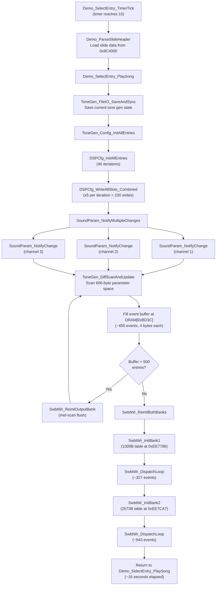
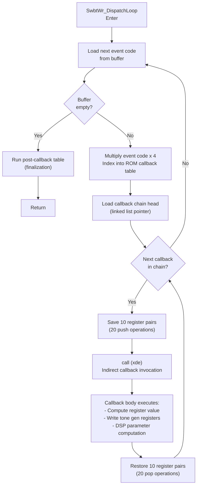
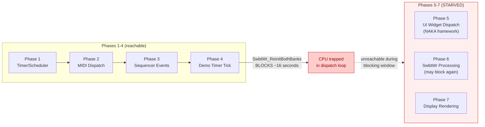

# Tone Generator Initialization (SwbtWr)

During Feature Demo, `SwbtWr_ReinitBothBanks` blocks the CPU for approximately 16 seconds while reinitializing the tone generator with new sound preset parameters. This blocking starves the NAKA widget framework, preventing the SSF visual presentation screen from activating.

This page documents the full initialization call graph, the event buffer system, the dispatch loop internals, and the impact on the main loop.

---

## Table of Contents

- [Overview](#overview)
- [Call Graph](#call-graph)
- [Event Buffer System](#event-buffer-system)
- [Dispatch Loop Detail](#dispatch-loop-detail)
- [Why It Takes ~16 Seconds](#why-it-takes-16-seconds)
- [Impact on NAKA Widget Framework](#impact-on-naka-widget-framework)
- [Flowcharts](#flowcharts)
- [Key Source Files](#key-source-files)
- [Related Pages](#related-pages)

---

## Overview

When the Feature Demo transitions to song playback, the firmware must reinitialize the tone generator hardware with the new sound preset's parameters. This is handled by `SwbtWr_ReinitBothBanks`, which processes two banks of tone generator events sequentially via `SwbtWr_DispatchLoop`. The entire operation is synchronous and blocking -- no interrupts are re-enabled, no cooperative yield points exist, and the main loop is completely starved for the duration.

The consequence is that phases 5-7 of the main loop (UI widget dispatch, SwbtWr post-processing, and display rendering) are unreachable during the ~16-second initialization window. The Feature Presentation screen's widget activation requires multiple main loop passes through the UI widget dispatch phase, which cannot occur while the CPU is trapped in the dispatch loop.

---

## Call Graph

The full call hierarchy from the demo timer tick through the tone generator reinitialization:

```
Demo_SelectEntry_TimerTick
  -> Demo_ParseSlideHeader
  -> Demo_SelectEntry_PlaySong
       -> ToneGen_FileIO_SaveAndSync
            -> ToneGen_Config_InitAllEntries
                 -> DSPCfg_InitAllEntries (46 iterations)
                      -> DSPCfg_WriteAllSlots_Combined (x5 per iteration)
       -> SoundParam_NotifyMultipleChanges
            -> SoundParam_NotifyChange (x3 channels)
                 -> ToneGen_DiffScanAndUpdate
                      (scans 606-byte parameter space, fills event buffer)
                      (mid-scan flush at 500 entries via SwbtWr_ReinitOutputBank)
       -> SwbtWr_ReinitBothBanks
            -> SwbtWr_InitBank1 (1309-byte table)
                 -> SwbtWr_DispatchLoop
            -> SwbtWr_InitBank2 (2573-byte table)
                 -> SwbtWr_DispatchLoop
```

The initialization begins when the demo timer reaches value 10, triggering `Demo_ParseSlideHeader` and `Demo_SelectEntry_PlaySong`. The song setup path first saves current tone generator state, reinitializes all DSP configuration entries (46 iterations with 5 slot writes each), then performs a diff scan of the 606-byte parameter space to determine which tone generator registers need updating.

---

## Event Buffer System

The event buffer is a central staging area for tone generator parameter changes:

| Property | Value |
|----------|-------|
| **Buffer location** | DRAM `0xBD3C` |
| **Entry size** | 4 bytes per event |
| **Batch capacity** | ~127 events per batch |
| **Total events per preset change** | ~450 |
| **Mid-scan flush threshold** | 500 entries |

### How Events Are Generated

`ToneGen_DiffScanAndUpdate` compares the current 606-byte parameter space against the new preset's parameters. For each byte that differs, it generates a 4-byte event record containing the parameter index and new value. When the buffer accumulates 500 entries during a scan, it triggers an early flush via `SwbtWr_ReinitOutputBank` to prevent overflow.

### Event Flow

```
Parameter diff scan (606 bytes)
  -> Generate 4-byte event per changed parameter
  -> Buffer at DRAM[0xBD3C]
  -> Flush when buffer hits 500 entries (mid-scan)
  -> Final flush after scan completes
  -> SwbtWr_DispatchLoop processes all buffered events
```

---

## Dispatch Loop Detail

`SwbtWr_DispatchLoop` is the inner engine that converts buffered events into tone generator hardware register writes. It processes events sequentially with no parallelism or batching optimization.

### Per-Event Processing Steps

1. **Load event code** from the buffer
2. **Index into ROM callback table** -- multiply event code by 4 to get the table offset
3. **Walk the callback chain** -- each table position holds a linked list of callbacks
4. **For each callback in the chain:**
   - Save 10 register pairs (20 push operations onto the stack)
   - Call the callback handler via indirect `call (xde)`
   - Restore 10 register pairs (20 pop operations from the stack)
5. **Advance to next event** in the buffer
6. **After all events:** run the post-callback table for finalization

### Bank Tables

| Bank | ROM Address | Table Size | Approximate Entries |
|------|-------------|------------|---------------------|
| Bank 1 | `0xEE7786` | 1309 bytes | ~327 entries |
| Bank 2 | `0xEE7CA7` | 2573 bytes | ~643 entries |

Bank 1 handles the primary tone generator parameters (voice control, pitch, velocity, waveform selection). Bank 2 handles secondary parameters (DSP effects, pan, modulation, auxiliary routing). Both banks are processed sequentially by `SwbtWr_ReinitBothBanks`.

### Callback Body

Each callback performs the actual hardware interaction -- computing the final register value from the event parameters and writing it to the tone generator's register-indirect interface (address latch at `0x100000`, data at `0x100002`). Callbacks also handle DSP parameter computation and effects send level calculations.

---

## Why It Takes ~16 Seconds

The ~16-second blocking duration results from the combination of:

| Factor | Contribution |
|--------|-------------|
| ~450 events per preset change | Base event count from diff scan |
| x2 banks = ~900+ dispatch iterations | Both banks processed sequentially |
| 20 push/pop operations per callback | 40 stack operations per callback invocation |
| Indirect call overhead | `call (xde)` through linked list chain |
| Callback body execution | Tone gen register writes, DSP computation |
| No yield points | 100% blocking -- no interrupt re-enable, no cooperative scheduling |
| No batching | Each event processed individually |

Additionally, `MainLoop_ReinitSwbtWr` (in the main loop's phase 6) calls `SwbtWr_ReinitBothBanks` **again** on the next main loop iteration if the sequencer startup has queued additional events. This can extend the total blocking time beyond the initial 16-second window.

### Timing Breakdown

At 16 MHz CPU clock, the per-event overhead of 40 stack operations plus an indirect call plus callback execution amounts to roughly 17-18 milliseconds per event. With ~900 events across both banks:

```
~900 events x ~18ms/event = ~16.2 seconds
```

---

## Impact on NAKA Widget Framework

The main loop in `system_handlers.s` (lines 1121-1254) processes these phases per iteration:

| Phase | Function | Description |
|-------|----------|-------------|
| 1 | Timer/scheduler | System tick processing |
| 2 | MIDI dispatch | Incoming MIDI message handling |
| 3 | Sequencer events | Sequence playback state machine |
| **4** | **Demo timer tick** | **Calls `SwbtWr_ReinitBothBanks` -- BLOCKS HERE** |
| 5 | UI widget dispatch | `MainTitle_PrepareAndDispatch` -- NAKA framework processing |
| **6** | **SwbtWr processing** | **`MainLoop_ReinitSwbtWr` -- MAY BLOCK AGAIN** |
| 7 | Display rendering | `Display_DirtyRegionDispatch` -- VRAM updates |

### Consequences of Blocking

- **Phases 5-7 are unreachable** while `SwbtWr_ReinitBothBanks` executes in phase 4
- The Feature Presentation screen's **widget activation requires multiple main loop passes** through phase 5 (UI widget dispatch)
- The **screen activation event `0x1C00001`** cannot be processed, so `SetCurrentTarget` is never called for the Feature Presentation screen
- Without `CurrentTarget` being set correctly, **broadcast event `0x1C00038`** is routed to the wrong widget handler
- The **SSF visual presentation never starts** because `GroupBoxProc_StartSSFPresentation` is never invoked
- **No display updates** occur during blocking -- the LCD shows a frozen frame
- **No input polling** occurs -- button presses during the blocking window are lost

This is the mechanism by which the tone generator initialization starves the NAKA widget framework and prevents the SSF presentation from activating. See [SSF Presentation System]({{ site.baseurl }}/ssf-presentation/#known-bug-mame-ssf-never-activates) for the full analysis of this failure mode.

---

## Flowcharts

### Full Initialization Sequence



### Dispatch Loop Detail



### Main Loop Phase Diagram



---

## Key Source Files

| Source File | Key Functions | Purpose |
|-------------|--------------|---------|
| `system_handlers.s` | `SwbtWr_ReinitBothBanks` (line 1422), main loop (line 1121), `MainLoop_ReinitSwbtWr` (line 1277) | Main loop and SwbtWr entry points |
| `dsp_config_sysex.s` | `SwbtWr_InitBank1`, `SwbtWr_InitBank2`, `SwbtWr_InitBank3`, `SwbtWr_DispatchLoop` | Bank initialization and event dispatch loop |
| `audio_control_engine.s` | `SwbtWr_FlushAndAppendParams`, `SwbtWr_WriteParamBlock` | Event buffer management and parameter writes |
| `tonegen_fileio_handlers.s` | `ToneGen_FileIO_SaveAndSync`, `ToneGen_DiffScanAndUpdate` | Tone gen state save/restore and parameter diff scanning |
| `file_demo_proc.s` | `Demo_SelectEntry_TimerTick`, `Demo_SelectEntry_PlaySong` | Demo timer state machine and song playback initiation |

All source files are in the `roms-disasm/maincpu/` directory tree.

---

## Related Pages

- [SSF Presentation System]({{ site.baseurl }}/ssf-presentation/) -- Full SSF analysis including the MAME activation bug caused by SwbtWr blocking
- [Feature Demo]({{ site.baseurl }}/feature-demo/) -- Feature Demo investigation history and timer bugs
- [Tone Generator]({{ site.baseurl }}/tone-generator/) -- Tone gen hardware registers and voice management
- [Audio Subsystem]({{ site.baseurl }}/audio-subsystem/) -- Audio architecture overview
- [Sound Parameter Protocol]({{ site.baseurl }}/sound-parameter-protocol/) -- Parameter change notification system
- [UI Framework]({{ site.baseurl }}/ui-framework/) -- NAKA widget framework (starved by blocking)

---

*Last updated: March 17, 2026*
